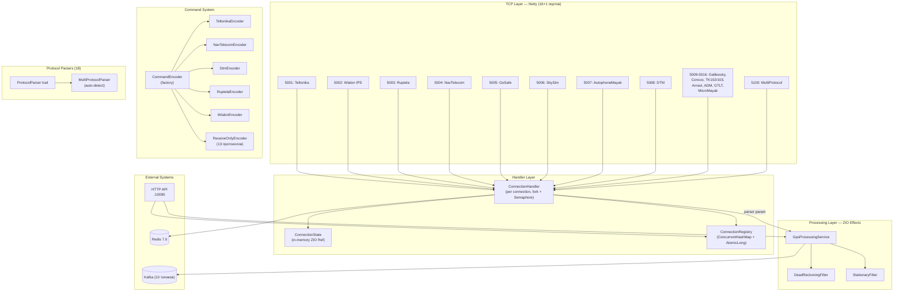
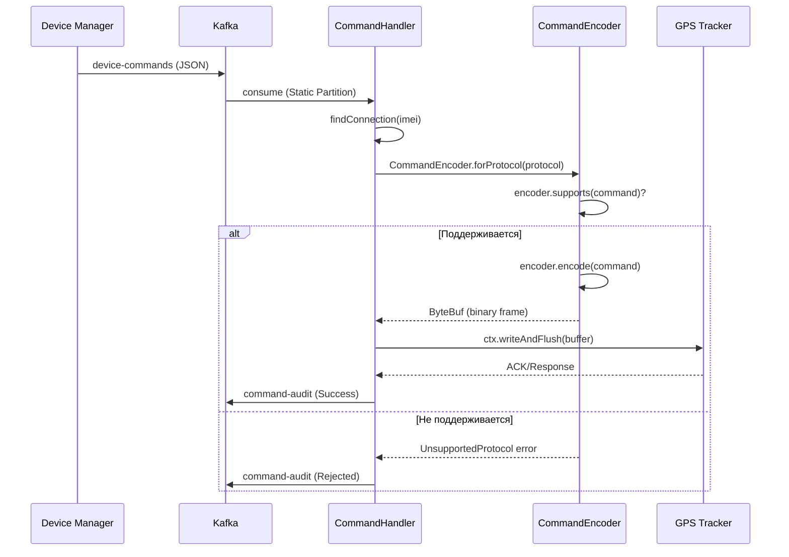
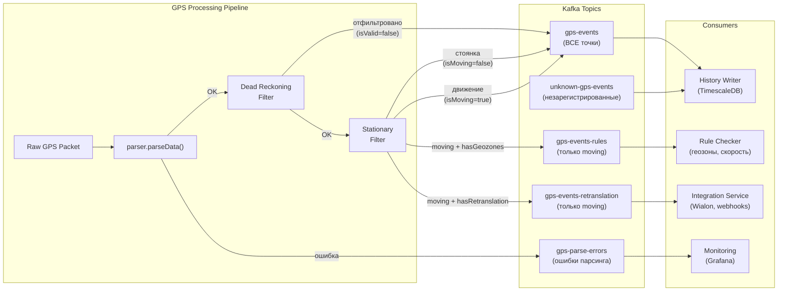
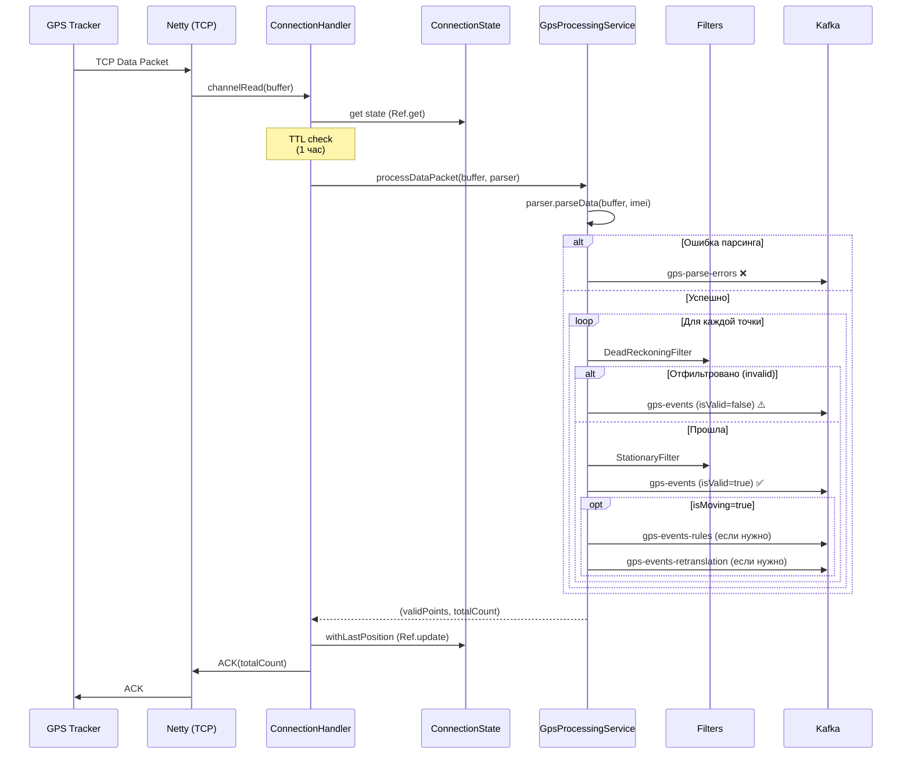
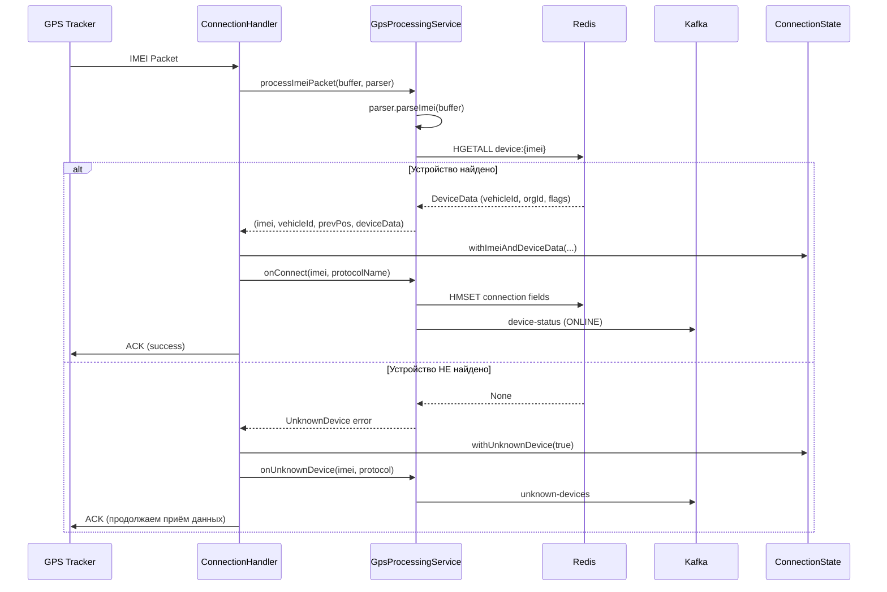

# Connection Manager — Архитектура v6.0

> Тег: `АКТУАЛЬНО` | Обновлён: `2026-03-11` | Версия: `6.0`

## Обзор

Connection Manager — микросервис приёма и первичной обработки GPS-данных.
Функционирует как Netty TCP-сервер на 16 протокольных портах + 1 multi-detect.
Поддерживает 18 GPS-протоколов, 10 типов команд для трекеров,
5 Kafka-топиков для маршрутизации GPS-данных.

**Оптимизирован для 100K+ одновременных TCP-соединений** (v5.0):
- Epoll/KQueue native transport (O(1) per event вместо O(n) NIO)
- ConcurrentHashMap + AtomicLong в ConnectionRegistry (0 аллокаций на hot path)
- Async fork + Semaphore в ConnectionHandler (Netty I/O thread никогда не блокируется)
- Кэш JSON сериализации (1× вместо 3× per GPS point)

**Новое в v6.0:**
- **CmMetrics** — 16 метрик (LongAdder + AtomicLong), Prometheus text exposition через `/api/metrics`
- **ФП-аудит фиксы** — `.toOption` → явный match + `ZIO.logWarning` (CommandHandler, RedisClient)
- **Безопасный парсинг** — `.toDoubleOption.getOrElse(0.0)` вместо `.toDouble.toInt` (ArnaviParser, GtltParser, GoSafeParser)
- **Clock.currentTime** в getIdleConnections вместо System.currentTimeMillis (TestClock совместимость)

## Ключевые метрики v6.0

| Компонент | Описание |
|---|---|
| **18 протоколов** | Teltonika, Wialon (3), Ruptela, NavTelecom, GoSafe, SkySim, Mayak, DTM, Galileosky, Concox, TK102/103, Arnavi, ADM, GTLT, MicroMayak |
| **10 типов команд** | Reboot, SetInterval, RequestPosition, SetOutput, SetParameter, Password, DeviceConfig, ChangeServer, Custom |
| **5 энкодеров** | Teltonika (Codec 12), NavTelecom (NTCB FLEX), DTM (binary), Ruptela (binary), Wialon (text) |
| **5 GPS-топиков** | gps-events, gps-events-rules, gps-events-retranslation, gps-parse-errors, unknown-gps-events |
| **16 CmMetrics** | activeConnections, totalConnections, packetsReceived, gpsPointsReceived, gpsPointsPublished, parseErrors, kafkaPublishSuccess, kafkaPublishErrors, redisOperations, unknownDevices, commandsSent, unknownDevicePackets, uptime |
| **560 тестов** | 0 failures, полный regression |

## Общая архитектура



## Архитектура команд v4.0

```mermaid
classDiagram
    class Command {
        <<sealed trait>>
        +commandId: String
        +imei: String
        +delivery: CommandDelivery
        +priority: Int
    }

    class CommandDelivery {
        <<enum>>
        Tcp
        Sms
        Auto
    }

    Command <|-- RebootCommand
    Command <|-- SetIntervalCommand
    Command <|-- RequestPositionCommand
    Command <|-- SetOutputCommand
    Command <|-- SetParameterCommand
    Command <|-- PasswordCommand
    Command <|-- DeviceConfigCommand
    Command <|-- ChangeServerCommand
    Command <|-- CustomCommand

    class CommandEncoder {
        <<trait>>
        +protocolName: String
        +encode(cmd): IO[ProtocolError, ByteBuf]
        +supports(cmd): Boolean
        +capabilities: CommandCapability
    }

    CommandEncoder <|-- TeltonikaEncoder
    CommandEncoder <|-- NavTelecomEncoder
    CommandEncoder <|-- DtmEncoder
    CommandEncoder <|-- RuptelaEncoder
    CommandEncoder <|-- WialonEncoder
    CommandEncoder <|-- ReceiveOnlyEncoder

    class CommandCapability {
        +protocol: String
        +supportedCommands: Set[String]
        +tcpCommands: Set[String]
        +smsCommands: Set[String]
        +requiresAuth: Boolean
    }

    Command --> CommandDelivery
    CommandEncoder --> CommandCapability
```



### Матрица поддержки команд по протоколам

| Команда | Teltonika | NavTelecom | DTM | Ruptela | Wialon | Остальные 13 |
|---|:---:|:---:|:---:|:---:|:---:|:---:|
| RebootCommand | ✅ TCP | — | — | ✅ TCP | — | — |
| SetIntervalCommand | ✅ TCP | — | — | ✅ TCP | — | — |
| RequestPositionCommand | ✅ TCP | — | — | ✅ TCP | — | — |
| SetOutputCommand | ✅ TCP | ✅ TCP | ✅ TCP | ✅ TCP | — | — |
| SetParameterCommand | ✅ TCP | — | — | — | — | — |
| PasswordCommand | — | ✅ TCP | — | — | — | — |
| DeviceConfigCommand | — | — | — | ✅ TCP | — | — |
| ChangeServerCommand | — | — | — | — | — | — |
| CustomCommand | ✅ TCP | ✅ TCP | — | ✅ TCP | ✅ TCP | — |

### Поток команды (Command Flow)



## Kafka-маршрутизация GPS-данных v4.0



### Правила маршрутизации

| Топик | Что попадает | Условие |
|---|---|---|
| **gps-events** | ВСЕ точки (valid + invalid + stationary) | Всегда. isValid/isMoving как маркеры |
| **gps-events-rules** | Только валидные + движущиеся | `isValid && isMoving && (hasGeozones \|\| hasSpeedRules)` |
| **gps-events-retranslation** | Только валидные + движущиеся | `isValid && isMoving && hasRetranslation` |
| **gps-parse-errors** | Ошибки парсинга | `parser.parseData()` вернул ProtocolError |
| **unknown-gps-events** | Точки от незарегистрированных | IMEI не найден в Redis `device:{imei}` |

## Горячий путь: GPS-пакет → Kafka



## Холодный путь: IMEI-аутентификация



## Жизненный цикл соединения

```mermaid
stateDiagram-v2
    [*] --> Connected: TCP connect
    Connected --> WaitingImei: channelActive()
    WaitingImei --> Authenticating: IMEI packet received
    Authenticating --> Authenticated: device found in Redis
    Authenticating --> UnknownDevice: device NOT in Redis

    Authenticated --> Receiving: GPS packets
    UnknownDevice --> ReceivingUnknown: GPS packets

    Receiving --> Receiving: more data
    Receiving --> ContextRefresh: TTL expired (1 hour)
    ContextRefresh --> Receiving: HGETALL device:{imei}
    ReceivingUnknown --> ReceivingUnknown: more data

    Receiving --> Disconnected: idle timeout / error / admin
    ReceivingUnknown --> Disconnected: idle timeout / error
    
    Disconnected --> [*]: cleanup
    
    note right of Authenticated: Redis: 1× HGETALL\nIn-memory: all subsequent reads
    note right of ContextRefresh: Обновляет DeviceData\nкаждый час
```

## Redis → In-Memory миграция (v3.0+)

| Операция | v2.x (Redis) | v3.0+ (In-Memory) |
|---|---|---|
| Позиция трекера | HMSET + SETEX на каждую точку | `ConnectionState.lastPosition` |
| DeviceData | HGETALL на каждый пакет | Кэш в ConnectionState (TTL 1 час) |
| Предыдущая позиция | HGETALL `position:{imei}` | `state.getPreviousPosition` |
| **Итого ops/день** | **~864M** | **~10K** |

**Что осталось в Redis:**
- `device:{imei}` HASH — 1× при аутентификации + refresh по TTL
- `connection:*` HASH — регистрация/разрегистрация
- Pub/Sub — команды, инвалидация конфигурации

## MultiProtocolParser — автодетект

```mermaid
flowchart TB
    subgraph "Quick Detect (O(1))"
        B1{"byte[0:2]"}
        B1 -->|"0x000F"| TEL[Teltonika]
        B1 -->|"0x2A3E"| NAV[NavTelecom]
        B1 -->|"0xF0xx"| SKY[SkySim]
        B1 -->|"0x4D0x"| MAY[AutophoneMayak]
        B1 -->|"0x7B0x"| DTM[DTM]
        B1 -->|"0x2324"| WIA[Wialon '#']
        B1 -->|"0x2A47"/ "0x2447"| GOS[GoSafe]
    end

    subgraph "Full Detect (fallback)"
        B1 -->|"не определён"| FD["рекурсивный перебор<br/>16 парсеров"]
        FD --> RESULT["detectedParser"]
    end
```

## Структура файлов v6.0

```
src/main/scala/com/wayrecall/tracker/
├── Main.scala                          # Точка входа, ZIO Layers
├── api/
│   └── HttpApi.scala                   # HTTP API (20+ endpoints) + CmMetrics output
├── command/                            # ★ NEW v4.0 — Command Encoders
│   ├── CommandEncoder.scala            # Базовый trait + factory + ReceiveOnlyEncoder
│   ├── TeltonikaEncoder.scala          # Codec 12 (TCP text commands)
│   ├── NavTelecomEncoder.scala         # NTCB FLEX (binary auth + IOSwitch)
│   ├── DtmEncoder.scala               # Binary IOSwitch (0x7B frame)
│   ├── RuptelaEncoder.scala            # Binary commands (0x65-0x67)
│   └── WialonEncoder.scala             # Text #M# commands
├── config/
│   ├── AppConfig.scala                 # HOCON конфигурация
│   └── DynamicConfigService.scala      # Динамическая конфигурация фильтров
├── domain/
│   ├── Protocol.scala                  # Enum протоколов (18), ошибки
│   ├── GpsPoint.scala                  # GpsPoint, GpsRawPoint, GpsEventMessage,
│   │                                   # GpsParseErrorEvent ★ NEW v4.0
│   ├── ParseError.scala                # ADT ошибок парсинга (10 типов)
│   ├── Command.scala                   # 10 типов команд, CommandDelivery,
│   │                                   # CommandCapability ★ REWRITTEN v4.0
│   └── Vehicle.scala                   # VehicleInfo
├── filter/
│   ├── DeadReckoningFilter.scala       # Фильтр телепортаций
│   └── StationaryFilter.scala          # Фильтр стоянок
├── network/
│   ├── ConnectionHandler.scala         # Netty handler + GpsProcessingService
│   │                                   # ★ v5.0: fork + Semaphore, zipPar Kafka, JSON cache
│   │                                   # ★ v6.0: CmMetrics instrumentation
│   ├── ConnectionRegistry.scala        # ConcurrentHashMap + AtomicLong (lock-free)
│   │                                   # ★ v5.0+v6.0: Clock.currentTime в getIdleConnections
│   ├── IdleConnectionWatcher.scala     # Фоновый fiber, параллельный disconnect (32)
│   ├── RateLimiter.scala               # Token Bucket (O(1) prepend)
│   ├── CommandService.scala            # Отправка команд (Redis Pub/Sub)
│   │                                   # ★ UPDATED v4.0: AwaitingCommand
│   └── TcpServer.scala                 # Netty bootstrap: Epoll/KQueue + socket tuning
│                                       # ★ REWRITTEN v5.0: SO_RCVBUF=4K, WaterMark, Pooled
├── protocol/                           # 18 протоколов
│   ├── ProtocolParser.scala            # Общий trait парсера
│   ├── TeltonikaParser.scala           # Teltonika Codec 8/8E
│   ├── WialonParser.scala              # Wialon IPS (text)
│   ├── WialonBinaryParser.scala        # Wialon Binary
│   ├── WialonAdapterParser.scala       # Auto-detect Wialon text/binary
│   ├── RuptelaParser.scala             # Ruptela GPS
│   ├── NavTelecomParser.scala          # NavTelecom FLEX
│   ├── GoSafeParser.scala              # GoSafe ASCII
│   ├── SkySimParser.scala              # SkySim (SkyPatrol)
│   ├── AutophoneMayakParser.scala      # Автофон Маяк
│   ├── DtmParser.scala                 # ДТМ (DTM)
│   ├── GalileoskyParser.scala          # Galileosky
│   ├── ConcoxParser.scala              # Concox GT06
│   ├── TK102Parser.scala               # TK102/TK103
│   ├── ArnaviParser.scala              # Arnavi
│   ├── AdmParser.scala                 # ADM
│   ├── GtltParser.scala                # Queclink GTLT
│   ├── MicroMayakParser.scala          # МикроМаяк
│   └── MultiProtocolParser.scala       # AutoDetect парсер
├── service/                            # ★ NEW v6.0
│   └── CmMetrics.scala                 # 16 метрик: LongAdder + AtomicLong, Prometheus output
└── storage/
    ├── KafkaProducer.scala             # 10 publish-методов, buffer.memory=256MB
    │                                   # ★ v5.0: buildProducerProps, max.in.flight=10
    └── RedisClient.scala               # Lettuce Redis операции (async fork)
                                        # ★ v6.0: .toOption → explicit match + logWarning
```
