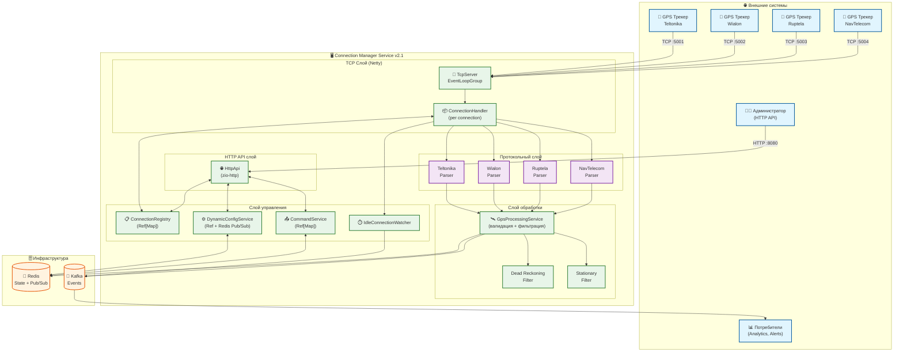
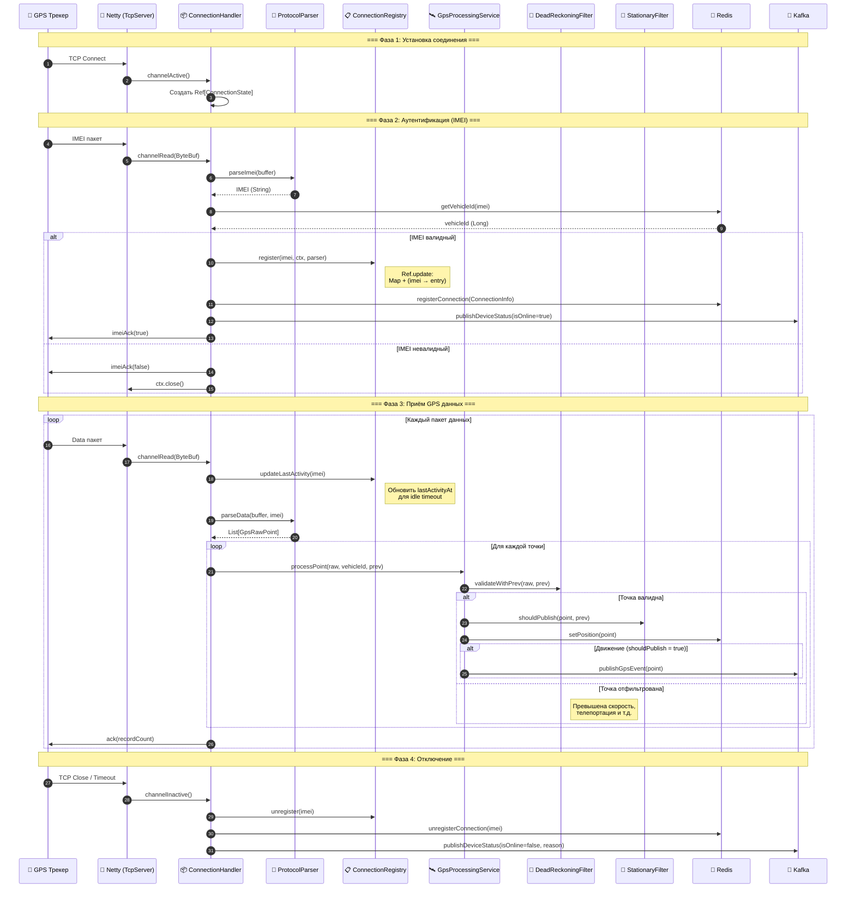
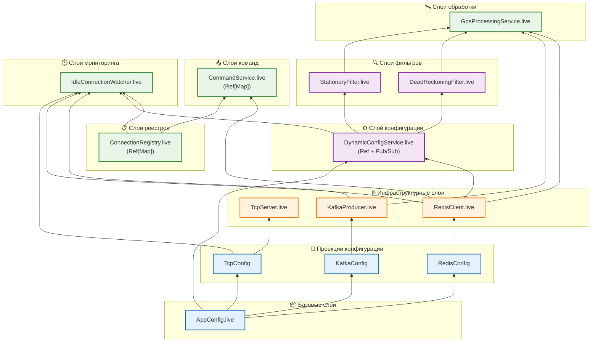
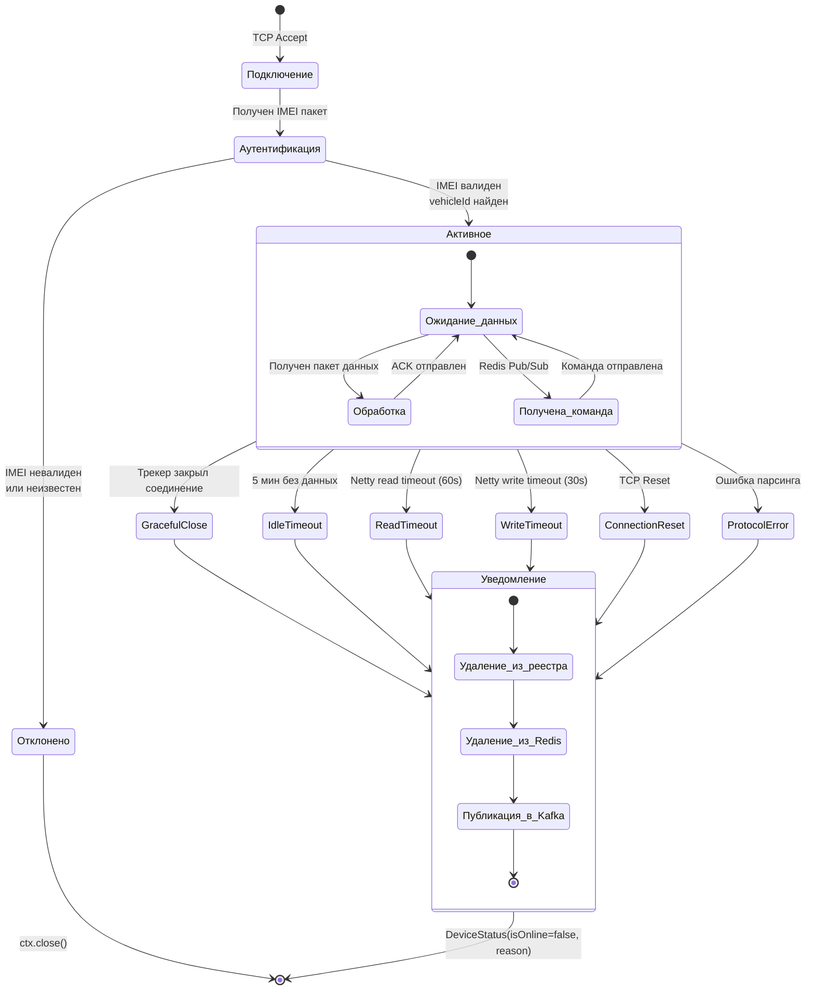
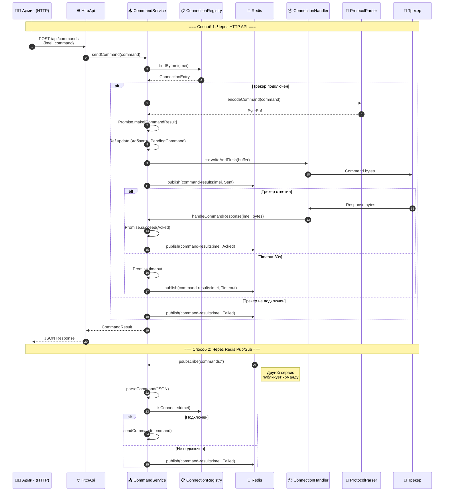
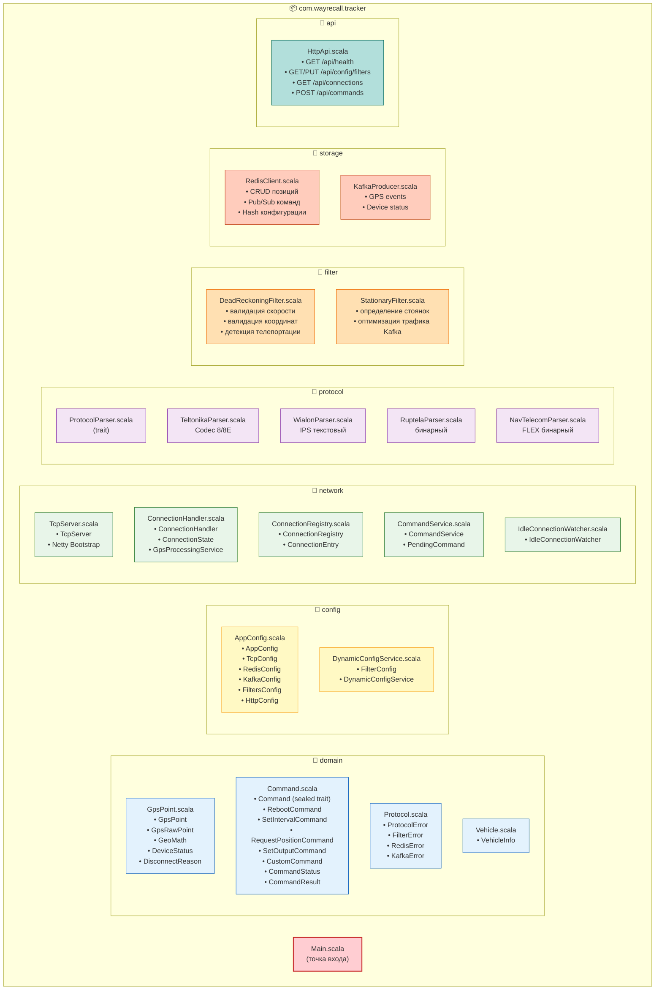
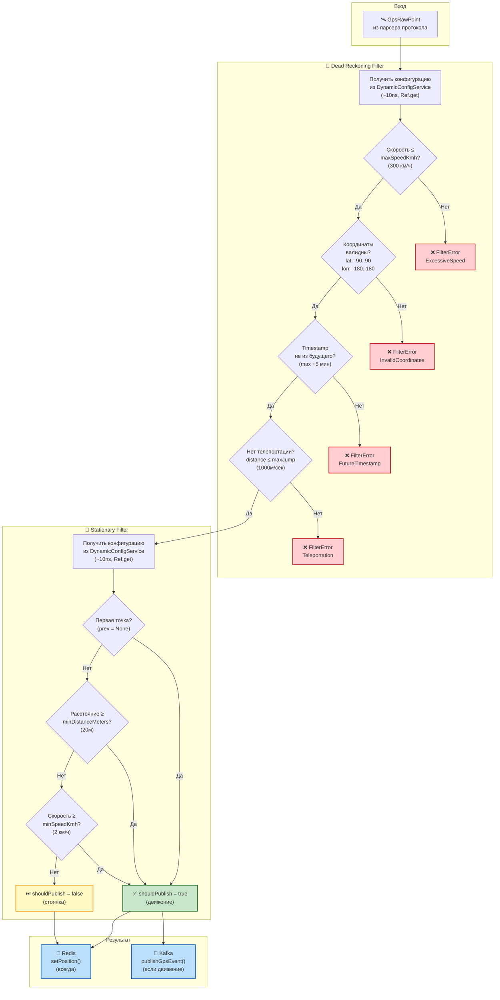
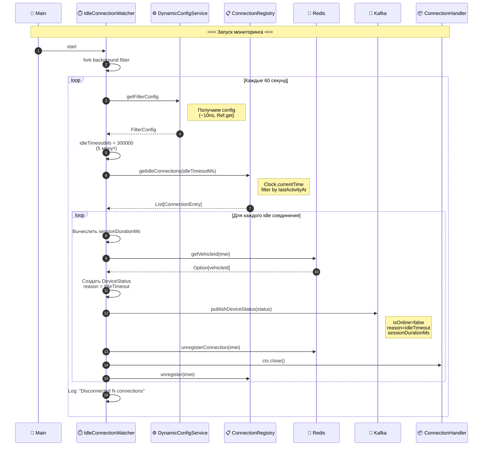
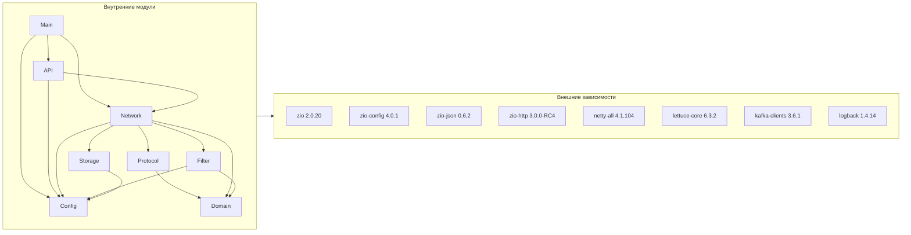

# 🏗️ Архитектурный анализ Connection Manager Service

> **Версия:** 2.1 (Pure FP)  
> **Дата анализа:** 16 января 2026  
> **Язык:** Scala 3.4.0 с ZIO 2.x

---

## 📋 Оглавление

1. [Общий обзор системы](#1-общий-обзор-системы)
2. [Архитектурные диаграммы](#2-архитектурные-диаграммы)
3. [Детальное описание компонентов](#3-детальное-описание-компонентов)
4. [Потоки данных](#4-потоки-данных)
5. [Анализ чистоты кода (FP)](#5-анализ-чистоты-кода-fp)
6. [Обнаруженные проблемы и упущения](#6-обнаруженные-проблемы-и-упущения)
7. [Рекомендуемые улучшения](#7-рекомендуемые-улучшения)
8. [Матрица зависимостей](#8-матрица-зависимостей)
9. [Checklist полноты реализации](#9-checklist-полноты-реализации)

---

## 1. Общий обзор системы

### 1.1 Назначение

**Connection Manager Service** — высокопроизводительный сервис для приёма и обработки GPS-данных от трекеров различных производителей. Реализован на принципах чистого функционального программирования (Pure FP).

### 1.2 Ключевые характеристики

| Параметр | Значение |
|----------|----------|
| **Язык** | Scala 3.4.0 |
| **Эффект-система** | ZIO 2.0.20 |
| **TCP-сервер** | Netty 4.1.104 |
| **Хранилище** | Redis (Lettuce 6.3.2) |
| **Очередь событий** | Apache Kafka 3.6.1 |
| **HTTP API** | zio-http 3.0.0-RC4 |
| **Конфигурация** | Typesafe Config + zio-config |

### 1.3 Поддерживаемые протоколы

| Протокол | Порт | Формат | Статус |
|----------|------|--------|--------|
| **Teltonika** (Codec 8/8E) | 5001 | Бинарный | ✅ Полная поддержка |
| **Wialon IPS** | 5002 | Текстовый | ✅ Полная поддержка |
| **Ruptela** | 5003 | Бинарный | ✅ Полная поддержка |
| **NavTelecom FLEX** | 5004 | Бинарный | ✅ Полная поддержка |

---

## 2. Архитектурные диаграммы

### 2.1 Общая архитектура системы (C4 Container)



### 2.2 Потоковая диаграмма обработки GPS данных



### 2.3 Диаграмма ZIO Layer композиции



### 2.4 Диаграмма жизненного цикла соединения



### 2.5 Диаграмма системы команд



### 2.6 Структура модулей и пакетов



### 2.7 Диаграмма фильтрации GPS данных



### 2.8 Диаграмма работы IdleConnectionWatcher



---

## 3. Детальное описание компонентов

### 3.1 Network Layer

#### TcpServer
| Аспект | Описание |
|--------|----------|
| **Ответственность** | Управление Netty ServerBootstrap для каждого протокола |
| **ZIO Layer** | `ZLayer.scoped` с acquireRelease для EventLoopGroup |
| **Потоки** | Boss: 1, Workers: 4 (настраивается) |
| **Опции сокета** | SO_BACKLOG=5000, SO_KEEPALIVE, TCP_NODELAY |
| **Таймауты** | Read: 60s, Write: 30s, Connection: 30s |

#### ConnectionHandler
| Аспект | Описание |
|--------|----------|
| **Ответственность** | Мост между Netty и ZIO, обработка пакетов |
| **Состояние** | `Ref[ConnectionState]` — IMEI, vehicleId, connectedAt, positionCache |
| **Ошибки** | Graceful error handling, logging через ZIO.logError |
| **Lifecycle** | channelActive → channelRead → channelInactive |

#### ConnectionRegistry
| Аспект | Описание |
|--------|----------|
| **Ответственность** | Реестр активных TCP соединений |
| **Хранилище** | `Ref[Map[String, ConnectionEntry]]` — чисто функционально! |
| **Операции** | register, unregister, findByImei, updateLastActivity, getIdleConnections |
| **Сложность** | O(1) для lookup, O(n) для getIdleConnections |

#### CommandService
| Аспект | Описание |
|--------|----------|
| **Ответственность** | Отправка команд на трекеры через соединение |
| **Хранилище** | `Ref[Map[String, PendingCommand]]` для ожидающих ответа |
| **Таймаут** | 30 секунд на ответ трекера |
| **Redis** | Подписка на `commands:*`, публикация результатов |

#### IdleConnectionWatcher
| Аспект | Описание |
|--------|----------|
| **Ответственность** | Отключение неактивных соединений |
| **Интервал** | Проверка каждые 60 секунд (настраивается) |
| **Таймаут** | 300 секунд (5 минут) без данных |
| **Уведомления** | Kafka DeviceStatus с reason=IdleTimeout |

### 3.2 Protocol Layer

#### ProtocolParser (trait)
```scala
trait ProtocolParser:
  def parseImei(buffer: ByteBuf): IO[ProtocolError, String]
  def parseData(buffer: ByteBuf, imei: String): IO[ProtocolError, List[GpsRawPoint]]
  def ack(recordCount: Int): ByteBuf
  def imeiAck(accepted: Boolean): ByteBuf
  def encodeCommand(command: Command): IO[ProtocolError, ByteBuf]
```

| Парсер | Формат IMEI | Формат координат | CRC |
|--------|-------------|------------------|-----|
| **Teltonika** | 2B length + ASCII | degrees × 10⁷ | CRC-16 |
| **Wialon** | `#L#imei;pwd` | DDMM.MMMM | нет |
| **Ruptela** | 8B Long | degrees × 10⁷ | CRC-16 |
| **NavTelecom** | 15B ASCII | degrees × 10⁷ | CRC-16-CCITT |

### 3.3 Filter Layer

#### DeadReckoningFilter
```
Проверки:
1. Скорость ≤ 300 км/ч
2. Координаты: lat ∈ [-90, 90], lon ∈ [-180, 180]
3. Timestamp ≤ now + 5 минут
4. Расстояние от предыдущей точки ≤ 1000м/сек
```

#### StationaryFilter
```
Логика публикации в Kafka:
- Первая точка: всегда публикуем
- Последующие: если distance ≥ 20м ИЛИ speed ≥ 2 км/ч

Оптимизация: снижает трафик Kafka на ~80% при стоянках
```

### 3.4 Storage Layer

#### RedisClient
| Операция | Ключ | TTL |
|----------|------|-----|
| Позиции | `position:{vehicleId}` | 3600s |
| Соединения | `connection:{imei}` | - |
| Vehicles | `vehicle:{imei}` | 3600s |
| Конфигурация | `config:filters` | - |
| Pub/Sub | `commands:*`, `config:updates` | - |

#### KafkaProducer
| Топик | Ключ | Содержимое |
|-------|------|------------|
| `raw-gps-events` | vehicleId | GpsPoint JSON |
| `device-status` | imei | DeviceStatus JSON |

---

## 4. Потоки данных

### 4.1 Входящий поток GPS данных

```
GPS Трекер → TCP (Netty) → ConnectionHandler → ProtocolParser 
          → GpsProcessingService → DeadReckoningFilter → StationaryFilter
          → Redis (позиции) + Kafka (события)
```

**Latency breakdown:**
- TCP accept: ~1ms
- IMEI parsing + Redis lookup: ~2-5ms
- Data parsing: ~0.1ms per record
- Filter validation: ~0.01ms (Ref.get = ~10ns)
- Redis write: ~1-2ms
- Kafka publish: ~5-10ms (async)

### 4.2 Исходящий поток команд

```
HTTP API / Redis Pub/Sub → CommandService → ConnectionRegistry.findByImei
                        → ProtocolParser.encodeCommand → Netty writeAndFlush
                        → GPS Трекер
```

### 4.3 Поток событий отключения

```
Netty (channelInactive / IdleWatcher) → ConnectionHandler/IdleWatcher
     → ConnectionRegistry.unregister → Redis.unregisterConnection
     → Kafka.publishDeviceStatus(reason)
```

---

## 5. Анализ чистоты кода (FP)

### 5.1 ✅ Чистые компоненты

| Компонент | Подход | Оценка |
|-----------|--------|--------|
| **ConnectionRegistry** | `Ref[Map]` вместо ConcurrentHashMap | ⭐⭐⭐⭐⭐ |
| **CommandService** | `Ref[Map]` для pending commands | ⭐⭐⭐⭐⭐ |
| **DynamicConfigService** | `Ref[FilterConfig]` + Pub/Sub | ⭐⭐⭐⭐⭐ |
| **DeadReckoningFilter** | Чистые функции валидации | ⭐⭐⭐⭐⭐ |
| **StationaryFilter** | Чистые предикаты | ⭐⭐⭐⭐⭐ |
| **GeoMath** | Чистый object с haversineDistance | ⭐⭐⭐⭐⭐ |
| **GpsProcessingService** | ZIO effects only | ⭐⭐⭐⭐⭐ |
| **IdleConnectionWatcher** | `Schedule.fixed` + pure effects | ⭐⭐⭐⭐⭐ |
| **ZIO Layer composition** | Декларативная композиция | ⭐⭐⭐⭐⭐ |

### 5.2 ⚠️ Компромиссы (необходимые)

| Компонент | Причина | Оценка |
|-----------|---------|--------|
| **ConnectionHandler.stateRef** | Netty ChannelHandler создаётся вне ZIO | ⭐⭐⭐⭐ |
| **TcpServer (Netty)** | Netty — императивный фреймворк | ⭐⭐⭐⭐ |
| **RedisClient.subscribe** | Callback API Lettuce | ⭐⭐⭐⭐ |

### 5.3 🎯 Использование ZIO Clock

| Файл | Использование |
|------|---------------|
| `ConnectionRegistry` | `Clock.currentTime` в register, updateLastActivity, getIdleConnections |
| `ConnectionHandler` | `Clock.currentTime` в handleImeiPacket |
| `CommandService` | `Clock.instant` в createResult |
| `IdleConnectionWatcher` | `Clock.currentTime` в disconnectWithNotification |
| `GpsProcessingService` | `Clock.currentTime` в onConnect, onDisconnect |
| `DeadReckoningFilter` | `Clock.currentTime` в validateTimestamp |

### 5.4 ❌ Оставшиеся проблемы

| Проблема | Файл | Строка | Исправление |
|----------|------|--------|-------------|
| `System.currentTimeMillis()` | HttpApi.scala | ~64 | Заменить на `Clock.currentTime` |
| `Instant.now()` | HttpApi.scala | ~145, ~157 | Заменить на `Clock.instant` |
| `System.currentTimeMillis()` | StationaryFilterSpec | ~39 | Допустимо в тестах |
| `System.currentTimeMillis()` | WialonParser | ~126 | Fallback при ошибке парсинга |

---

## 6. Обнаруженные проблемы и упущения

### 6.1 🔴 Критические

| # | Проблема | Риск | Рекомендация |
|---|----------|------|--------------|
| 1 | **Нет graceful shutdown для TcpServer** | При SIGTERM могут теряться данные | Добавить ZIO.addFinalizer для закрытия всех соединений |
| 2 | **Нет backpressure для Kafka** | При перегрузке Kafka теряем события | Использовать bounded queue + retry |
| 3 | **Нет circuit breaker для Redis** | Падение Redis → падение сервиса | Добавить Resilience4j или ZIO Circuit Breaker |
| 4 | **ConnectionHandler: Unsafe.unsafe** | Неявная обработка ошибок | Логировать ошибки из runEffect |

### 6.2 🟠 Важные

| # | Проблема | Риск | Рекомендация |
|---|----------|------|--------------|
| 5 | **Нет метрик Prometheus** | Нет observability | Добавить zio-metrics |
| 6 | **Нет health-check Redis/Kafka** | /api/health не проверяет зависимости | Добавить проверки в endpoint |
| 7 | **Instant.now() в HttpApi** | Нарушение чистоты | Заменить на Clock.instant |
| 8 | **Нет rate limiting на HTTP API** | DDoS уязвимость | Добавить middleware |
| 9 | **Hardcoded timeout в CommandService** | Нельзя настроить runtime | Вынести в конфигурацию |
| 10 | **Нет retry при ошибках Kafka** | Потеря событий | Добавить retry с exponential backoff |

### 6.3 🟡 Улучшения

| # | Проблема | Рекомендация |
|---|----------|--------------|
| 11 | **Нет поддержки TLS** | Добавить SSL handler в Netty pipeline |
| 12 | **Нет IMEI whitelist/blacklist** | Добавить проверку в Redis |
| 13 | **Нет логирования в Kafka** | Добавить audit log topic |
| 14 | **Нет compression для Redis** | Включить LZ4 для больших данных |
| 15 | **Тесты только для 2 компонентов** | Добавить тесты для всех парсеров |
| 16 | **Нет integration tests** | Добавить testcontainers |
| 17 | **Нет документации API (OpenAPI)** | Генерировать из zio-http |
| 18 | **IdleTimeout не в DynamicConfig** | Добавить в FilterConfig для runtime изменений |

---

## 7. Рекомендуемые улучшения

### 7.1 Приоритет 1: Надёжность

```scala
// 1. Graceful Shutdown
val program = for
  registry <- ZIO.service[ConnectionRegistry]
  _ <- ZIO.addFinalizer {
    for
      connections <- registry.getAllConnections
      _ <- ZIO.foreachDiscard(connections) { entry =>
        ZIO.attempt(entry.ctx.close()).ignore
      }
      _ <- ZIO.logInfo(s"Gracefully closed ${connections.size} connections")
    yield ()
  }
  // ... rest of program
yield ()

// 2. Circuit Breaker для Redis
val redisWithCircuitBreaker = CircuitBreaker.make(
  maxFailures = 5,
  reset = 30.seconds
).flatMap { cb =>
  redisClient.withCircuitBreaker(cb)
}

// 3. Retry для Kafka
def publishWithRetry(event: GpsPoint): Task[Unit] =
  kafkaProducer.publishGpsEvent(event)
    .retry(Schedule.exponential(100.millis) && Schedule.recurs(3))
```

### 7.2 Приоритет 2: Observability

```scala
// Prometheus metrics
object Metrics:
  val activeConnections = Counter.gauge("tracker_active_connections")
  val gpsPointsReceived = Counter.counter("tracker_gps_points_total")
  val gpsPointsFiltered = Counter.counter("tracker_gps_points_filtered_total")
  val commandsSent = Counter.counter("tracker_commands_sent_total")
  val kafkaPublishLatency = Histogram.histogram("tracker_kafka_publish_seconds")
```

### 7.3 Приоритет 3: Безопасность

```scala
// TLS Support
pipeline.addLast("ssl", SslContextBuilder
  .forServer(certFile, keyFile)
  .build()
  .newHandler(ch.alloc()))

// Rate Limiting
val rateLimitMiddleware = RateLimiter.middleware(
  maxRequests = 100,
  window = 1.minute
)
```

### 7.4 Приоритет 4: Тестируемость

```scala
// TestContainers для интеграционных тестов
val redisContainer = GenericContainer("redis:7")
val kafkaContainer = KafkaContainer("confluentinc/cp-kafka:7.5.0")

def integrationTestLayer = ZLayer.scoped {
  for
    redis <- ZIO.acquireRelease(redisContainer.start)(_.stop)
    kafka <- ZIO.acquireRelease(kafkaContainer.start)(_.stop)
  yield IntegrationTestEnv(redis, kafka)
}
```

---

## 8. Матрица зависимостей



---

## 9. Checklist полноты реализации

### 9.1 Функциональность

| Категория | Функция | Статус |
|-----------|---------|--------|
| **TCP** | Multi-protocol server | ✅ |
| **TCP** | Connection timeout | ✅ |
| **TCP** | Idle timeout | ✅ |
| **TCP** | Graceful shutdown | ⚠️ Частично |
| **TCP** | TLS/SSL | ❌ |
| **Protocols** | Teltonika Codec 8/8E | ✅ |
| **Protocols** | Wialon IPS | ✅ |
| **Protocols** | Ruptela | ✅ |
| **Protocols** | NavTelecom FLEX | ✅ |
| **Filtering** | Speed validation | ✅ |
| **Filtering** | Coordinate validation | ✅ |
| **Filtering** | Teleportation detection | ✅ |
| **Filtering** | Stationary detection | ✅ |
| **Commands** | Send via HTTP | ✅ |
| **Commands** | Send via Redis Pub/Sub | ✅ |
| **Commands** | Response handling | ✅ |
| **Commands** | Timeout handling | ✅ |
| **Config** | Static (HOCON) | ✅ |
| **Config** | Dynamic (Redis) | ✅ |
| **Config** | Environment override | ✅ |
| **Storage** | Redis positions | ✅ |
| **Storage** | Redis connections | ✅ |
| **Storage** | Kafka GPS events | ✅ |
| **Storage** | Kafka device status | ✅ |
| **API** | Health check | ✅ |
| **API** | Config management | ✅ |
| **API** | Connection list | ✅ |
| **API** | Send command | ✅ |
| **API** | OpenAPI docs | ❌ |
| **API** | Rate limiting | ❌ |

### 9.2 Non-Functional

| Категория | Требование | Статус |
|-----------|------------|--------|
| **Performance** | 5000+ concurrent connections | ✅ Конфиг |
| **Performance** | ~10ns config read | ✅ Ref |
| **Reliability** | Disconnect notifications | ✅ |
| **Reliability** | Redis circuit breaker | ❌ |
| **Reliability** | Kafka retry | ❌ |
| **Observability** | Logging | ✅ SLF4J |
| **Observability** | Metrics | ❌ |
| **Observability** | Tracing | ❌ |
| **Security** | TLS | ❌ |
| **Security** | IMEI whitelist | ❌ |
| **Testing** | Unit tests | ⚠️ 2 файла |
| **Testing** | Integration tests | ❌ |

---

## 10. Заключение

### Сильные стороны архитектуры:
1. ✅ **Чистый FP** — все состояние в ZIO Ref
2. ✅ **Модульность** — четкое разделение на слои
3. ✅ **Масштабируемость** — ZIO Layer для DI
4. ✅ **Динамическая конфигурация** — Redis Pub/Sub
5. ✅ **Множество протоколов** — 4 парсера с общим интерфейсом
6. ✅ **Observability** — события отключения в Kafka

### Области для улучшения:
1. 🔴 Graceful shutdown
2. 🔴 Circuit breaker / retry
3. 🟠 Prometheus метрики
4. 🟠 TLS поддержка
5. 🟠 Расширенное тестирование
6. 🟡 OpenAPI документация

---

*Документ создан: 16 января 2026*  
*Автор: AI Architecture Analyst*
