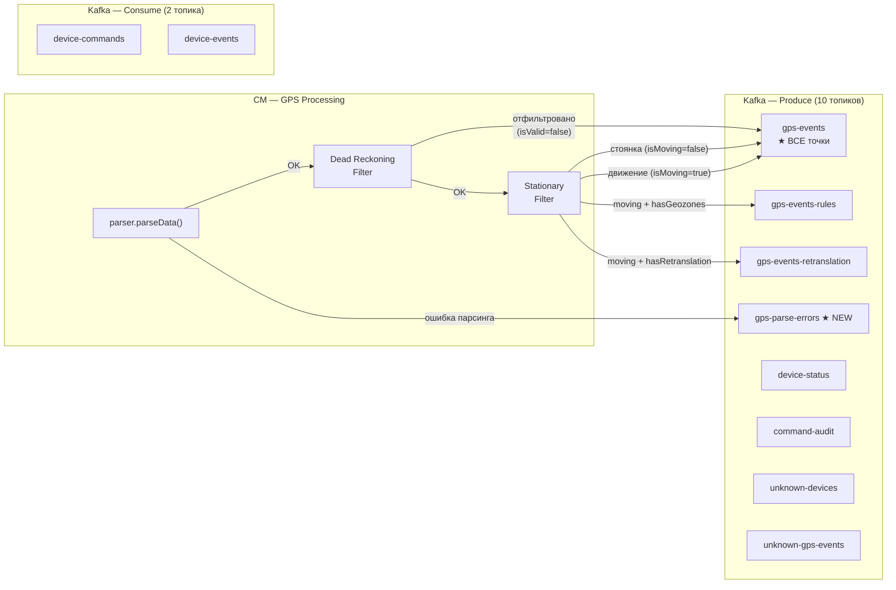
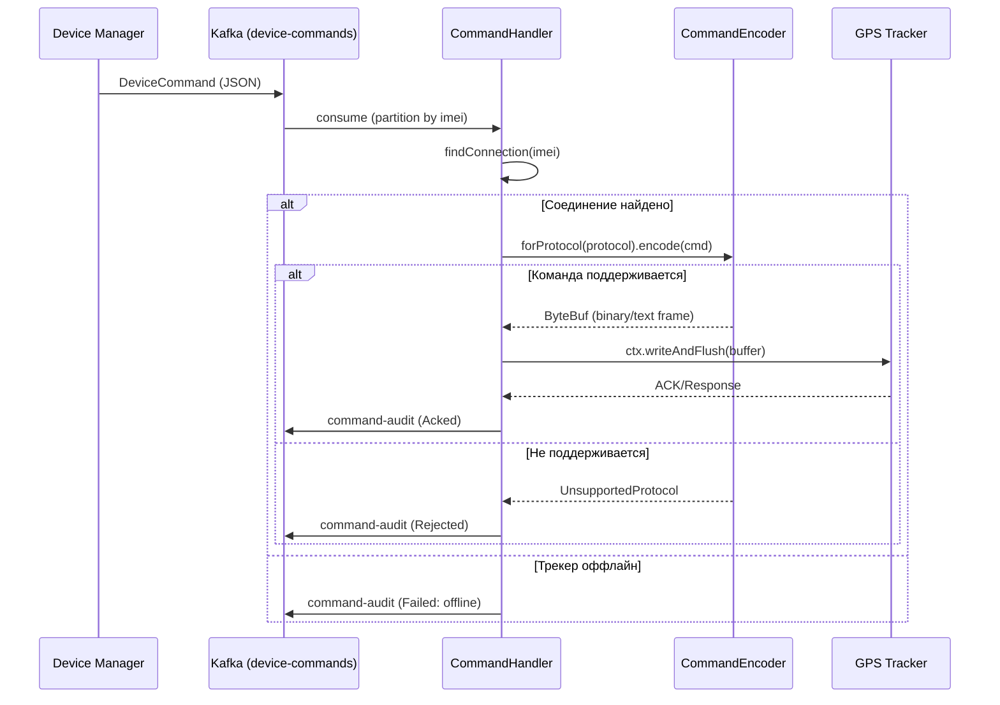
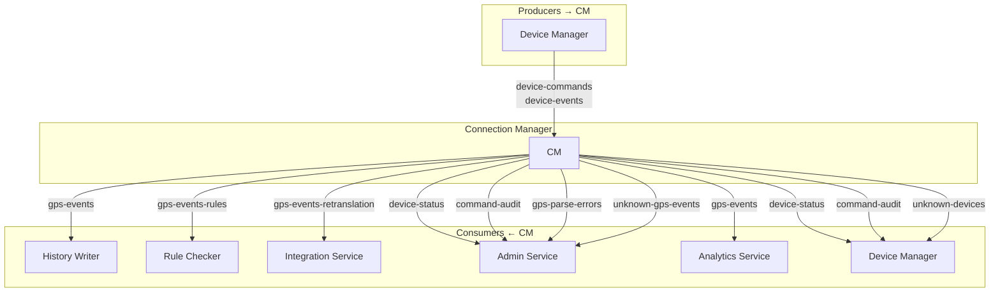

# Connection Manager — Kafka v4.0

> Тег: `АКТУАЛЬНО` | Обновлён: `2026-03-01` | Версия: `4.0`

> Полное описание всех топиков → [infra/kafka/TOPICS.md](../../../infra/kafka/TOPICS.md)

## Учебные пометки в этом документе

Если у тебя вопрос по конкретному месту, оставляй HTML-комментарий прямо рядом с абзацем:

<!-- QUESTION(U): почему именно такой partition key? -->
<!-- WHY(U): зачем дублируем событие в rules/retranslation? -->
<!-- CONFUSED(U): не понимаю когда идет publish в unknown-gps-events -->
<!-- TRACE(U): разложи путь сообщения от parser до топика -->
<!-- ANSWER(AI): partition key = vehicleId/imei нужен для стабильного порядка событий одного устройства в пределах партиции. -->
<!-- ANSWER(AI): дублирование в rules/retranslation не технический дубль, а целевая маршрутизация в разные доменные консьюмеры с разной нагрузкой и SLA. -->
<!-- ANSWER(AI): unknown-gps-events используется, когда устройство не распознано/не зарегистрировано в контексте и точка не может идти в обычный валидированный поток. -->
<!-- WALKTHROUGH(AI): parser.parseData -> при ошибке gps-parse-errors; при успехе DeadReckoning -> Stationary -> всегда gps-events; дополнительно при флагах устройства в deviceData: gps-events-rules и/или gps-events-retranslation; при unknown-устройстве путь идет в unknown-gps-events. -->
<!-- NEXTSTEP(AI): проверь в логах и тестах ConnectionHandler ветки publish для isValid/isMoving и unknown-device сценарий. -->

Я буду отвечать рядом:

<!-- ANSWER(AI): короткий ответ по месту -->
<!-- WALKTHROUGH(AI): пошаговый разбор потока -->
<!-- NEXTSTEP(AI): что проверить локально -->

## Общая схема маршрутизации



## Публикует (Produce) — 10 топиков

### gps-events ★ ОБНОВЛЕНО v4.0

**ВСЕ GPS-точки** — валидные, отфильтрованные, стоянки.
Маркеры `isValid` и `isMoving` позволяют consumers фильтровать.

> **Изменение v4.0:** В v3.0 публиковались только валидные + moving точки.
> Теперь ВСЕ точки попадают в gps-events, включая отфильтрованные
> Dead Reckoning фильтром (isValid=false) и стоянки (isMoving=false).
> Это нужно для полноты TimescaleDB-истории.

| Параметр | Значение |
|---|---|
| Ключ партиции | `vehicleId` (Long → String) |
| Формат | JSON (GpsEventMessage) |
| Consumers | history-writer, analytics-service |
| Объём | ~10K msg/sec при 10K трекеров |
| Retention | 7 дней |

**Семантика флагов:**

| isValid | isMoving | Источник | Описание |
|---|---|---|---|
| true | true | Прошла оба фильтра | Нормальная точка, движение |
| true | false | Прошла DR, не прошла Stationary | Стоянка (GPS дрожание подавлено) |
| false | false | Не прошла Dead Reckoning | Телепортация, невалидный GPS |

### gps-events-rules

GPS-точки только для устройств с активными правилами.
**Только `isValid=true && isMoving=true`.**

| Параметр | Значение |
|---|---|
| Ключ | `vehicleId` |
| Условие | `deviceData.hasGeozones \|\| deviceData.hasSpeedRules` |
| Consumers | rule-checker |

### gps-events-retranslation

GPS-точки для устройств с активной ретрансляцией (Wialon, webhooks).
**Только `isValid=true && isMoving=true`.** Включает `rawPacketHex`.

| Параметр | Значение |
|---|---|
| Ключ | `vehicleId` |
| Условие | `deviceData.hasRetranslation` |
| Consumers | integration-service |

### gps-parse-errors ★ NEW v4.0

Ошибки парсинга GPS-пакетов. Для мониторинга и отладки протоколов.

| Параметр | Значение |
|---|---|
| Ключ | `imei` (или "unknown" если IMEI не определён) |
| Формат | JSON (GpsParseErrorEvent) |
| Consumers | admin-service, monitoring (Grafana) |
| Retention | 3 дня |
| Партиции | 3 |

**Когда публикуется:**
- `parser.parseData()` бросает `ProtocolError`
- Включает hex-dump первых 512 байт пакета для отладки
- Тип ошибки: InvalidChecksum, InvalidCodec, ParseError, InsufficientData, InvalidImei, UnknownDevice, UnsupportedProtocol, ProtocolDetectionFailed

**Пример:**
```json
{
  "imei": "352094080055555",
  "protocol": "teltonika",
  "errorType": "InvalidChecksum",
  "errorMessage": "CRC mismatch: expected 0xA1B2, got 0xC3D4",
  "rawPacketHex": "000f333532303934303830303535353535...",
  "rawPacketSize": 128,
  "remoteAddress": "192.168.1.100:45678",
  "instanceId": "cm-instance-1",
  "timestamp": 1709290000050
}
```

### device-status

События подключения/отключения трекеров.

| Параметр | Значение |
|---|---|
| Ключ | `imei` |
| Consumers | device-manager, admin-service |
| События | CONNECTED, DISCONNECTED |

### command-audit

Аудит отправки и выполнения команд. Расширен в v4.0.

| Параметр | Значение |
|---|---|
| Ключ | `imei` |
| Consumers | device-manager, admin-service |
| Статусы | Sent, Delivered, Acked, Failed, Timeout, Rejected |

### unknown-devices

Событие при подключении незарегистрированного трекера.

| Параметр | Значение |
|---|---|
| Ключ | `imei` |
| Consumers | device-manager (auto-registration), admin-service |

### unknown-gps-events

GPS-точки от незарегистрированных трекеров (без фильтрации).

| Параметр | Значение |
|---|---|
| Ключ | `imei` |
| Consumers | admin-service |

## Потребляет (Consume) — 2 топика

### device-commands

Команды на трекеры (от Device Manager или Admin Service).  
CM потребляет, находит TCP-соединение по IMEI, отправляет команду через `CommandEncoder`.

| Параметр | Значение |
|---|---|
| Consumer Group | `connection-manager` |
| Ключ | `imei` |
| Producers | device-manager |

**Поток обработки команды:**



### device-events

События об изменениях устройств (для инвалидации in-memory кэша).

| Параметр | Значение |
|---|---|
| Consumer Group | `connection-manager` |
| Ключ | `imei` |
| Producers | device-manager |

## Конфигурация Kafka

```hocon
kafka {
  bootstrap-servers = "localhost:9092"
  topics {
    gps-events            = "gps-events"
    gps-events-rules      = "gps-events-rules"
    gps-events-retranslation = "gps-events-retranslation"
    gps-parse-errors      = "gps-parse-errors"       # ★ NEW v4.0
    device-status         = "device-status"
    device-commands       = "device-commands"
    device-events         = "device-events"
    command-audit         = "command-audit"
    unknown-devices       = "unknown-gps-events"
    unknown-gps-events    = "unknown-gps-events"
  }
  producer {
    acks = "1"
    retries = 3
    batch-size = 16384
    linger-ms = 10
  }
  consumer {
    group-id = "connection-manager"
    session-timeout-ms = 30000
    auto-offset-reset = "latest"
    max-poll-records = 100
  }
}
```

## Диаграмма взаимодействий по топикам


