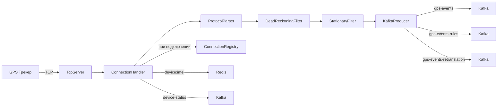
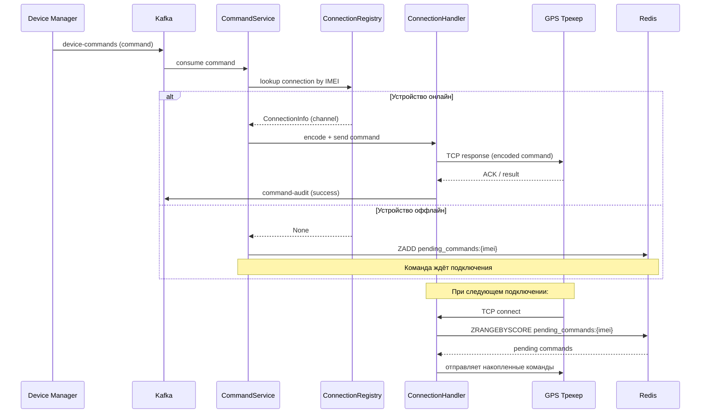
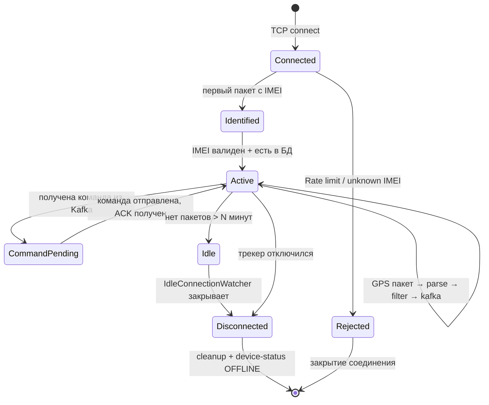
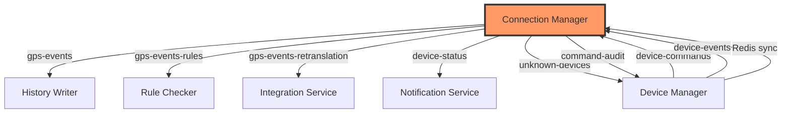

> Тег: `АКТУАЛЬНО` | Обновлён: `2026-03-11` | Версия: `3.0`

# 📖 Изучение Connection Manager

> Это руководство поможет разобраться в устройстве Connection Manager — центрального TCP-сервиса приёма GPS-данных.

## Как оставлять вопросы по месту

Пока изучаешь сервис, оставляй вопросы прямо рядом с нужным фрагментом.

Для Markdown используй:

<!-- QUESTION(U): что делает этот этап? -->
<!-- WHY(U): почему выбрано именно такое решение? -->
<!-- CONFUSED(U): тут потерял контекст -->
<!-- TRACE(U): нужен пошаговый путь данных -->

Я отвечаю рядом:

<!-- ANSWER(AI): краткий ответ -->
<!-- WALKTHROUGH(AI): шаги выполнения -->
<!-- NEXTSTEP(AI): что проверить в коде или тестах -->

Полный стандарт тегов: docs/LEARNING_COMMENT_STYLE.md

---

## 1. Назначение сервиса

**Connection Manager (CM)** — сердце системы. Это TCP-сервер, который:
- Принимает сырые бинарные/текстовые пакеты от GPS-трекеров по TCP  
- Поддерживает **18 протоколов** трекеров разных производителей  
- Парсит пакеты в единый формат `GpsPoint`  
- Фильтрует шум (фильтры Dead Reckoning и Stationary)  
- Публикует координаты в Kafka для остальных сервисов  
- Принимает и выполняет команды на трекеры (блокировка, перезагрузка, смена настроек)  
- Ведёт реестр активных соединений и мониторит их состояние  

**Порты:** 5001–5017 (TCP, по одному на протокол), 10090 (HTTP API для health/metrics)

---

## 2. Архитектура и компоненты

### Обзор слоёв

```
[GPS Трекер] → TCP:5001-5017 → TcpServer → ConnectionHandler → ProtocolParser
                                                                       ↓
                                                               DeadReckoningFilter
                                                                       ↓
                                                               StationaryFilter
                                                                       ↓
                                                               KafkaProducer → [Kafka]
```

### Разбор файлов

#### `Main.scala` — Точка входа
- Собирает все ZIO Layer в граф зависимостей
- Запускает TCP серверы + HTTP сервер + фоновые задачи
- Реализует graceful shutdown (закрывает все TCP соединения)

#### `config/AppConfig.scala`
- HOCON конфигурация через `zio-config + magnolia`
- Параметры: TCP порты, Redis хост/порт, Kafka broker, batch size, timeouts
- `deriveConfig[AppConfig]` — автоматический вывод из HOCON

#### `config/DynamicConfigService.scala`
- Подписка на Redis Pub/Sub канал `cm:config`
- Позволяет менять параметры (batch size, таймауты) без рестарта
- При получении сообщения — обновляет `Ref[AppConfig]`

#### `network/TcpServer.scala`
- **Netty 4.1** как TCP фреймворк
- Запускает `ServerBootstrap` на указанных портах
- `ChannelInitializer` → создаёт pipeline: `IdleStateHandler` → `ConnectionHandler`
- Каждый порт привязан к конкретному протоколу (5001=Teltonika, 5002=Wialon, ...)
- **v5.0:** Epoll (Linux) / KQueue (macOS) native transport — O(1) per event вместо O(n) NIO
- **v5.0:** SO_BACKLOG=4096, SO_RCVBUF=4096, SO_SNDBUF=4096, WriteBufferWaterMark(16K,32K), PooledByteBufAllocator

#### `network/ConnectionHandler.scala`
- **Главный класс** — обрабатывает жизненный цикл TCP соединения
- `channelActive` → регистрация в ConnectionRegistry
- `channelRead` → парсинг буфера через ProtocolParser
- `channelInactive` → удаление из реестра, обновление статуса в Redis
- Поддерживает отправку ответов (ACK) и команд обратно в трекер
- **v5.0:** `runtime.unsafe.fork()` + `Semaphore(1)` per connection — Netty I/O thread **никогда не блокируется**
- **v5.0:** `rulesEffect.zipPar(retranslationEffect)` — параллельный publish в 3 Kafka-топика
- **v5.0:** JSON кэш — `msg.toJson` вызывается 1 раз, результат используется для всех 3 топиков
- **v5.0:** `java.lang.System.currentTimeMillis()` / `java.time.Instant.now()` вместо ZIO Clock (0 аллокаций)

#### `network/ConnectionRegistry.scala`
- **v5.0 REWRITTEN:** `ConcurrentHashMap[String, MutableConnectionEntry]` + `AtomicLong` для `lastActivityAt`
- Lock-free: 0 аллокаций на hot path, O(1) для register/unregister/updateActivity
- `unregisterIfSame(imei, channel)` — атомарная проверка владельца канала (устраняет race condition)
- Хранит: IMEI → канал Netty, протокол, время подключения, vehicleId, orgId
- Используется для: отправки команд, мониторинга, закрытия соединений
- Бывшая реализация `ZIO Ref[Map]` заменена ради устранения аллокаций при 100K соединениях

#### `network/CommandService.scala`
- Kafka consumer топика `device-commands`
- Получает команду → находит соединение в Registry → кодирует → отправляет через TCP
- Если устройство оффлайн → сохраняет в Redis `pending_commands:{imei}`
- Когда устройство подключается → отправляет накопленные команды

#### `network/RateLimiter.scala`
- Token Bucket алгоритм для защиты от DDoS
- Ограничивает количество подключений в секунду и пакетов на IMEI
- **v5.0:** `now :: validTimestamps` — O(1) prepend вместо O(n) append

#### `network/IdleConnectionWatcher.scala`
- Фоновый fiber, проверяет каждые N секунд
- Закрывает соединения без пакетов > N минут
- Публикует `device-status` в Kafka с статусом OFFLINE
- **v5.0:** `foreachParDiscard` + `withParallelism(32)` — параллельный disconnect

#### `network/DeviceConfigListener.scala`
- Redis Pub/Sub: каналы `device-config:*`
- Получает обновления конфига устройства (смена протокола, новый IMEI — маппинг)
- Обновляет локальный кэш `VehicleLookupService`

#### `network/IdleConnectionWatcher.scala`
- Фоновый fiber, проверяет каждые N секунд
- Закрывает соединения без пакетов > N минут
- Публикует `device-status` в Kafka с статусом OFFLINE

#### `protocol/MultiProtocolParser.scala`
- Auto-detect протокола по первым байтам пакета
- Используется на "общем" порту если нужно
- Содержит список всех 18 парсеров

#### `protocol/TeltonikaParser.scala` (пример парсера)
- Парсит Codec 8 / 8E бинарный протокол Teltonika
- Структура: preamble (4 bytes) → data length → codec ID → records → CRC
- Каждый record: timestamp, priority, GPS data, IO events
- Возвращает `List[GpsPoint]` (один пакет = несколько точек)

#### `filter/DeadReckoningFilter.scala`
- Отбрасывает точки, которые физически невозможны (телепортация)
- Проверяет: скорость между точками < MAX_SPEED, расстояние < MAX_DISTANCE
- Использует формулу Haversine для расчёта расстояния

#### `filter/StationaryFilter.scala`
- Если ТС стоит на месте — не дублировать одинаковые координаты
- Проверяет: расстояние от последней точки < MIN_DISTANCE и скорость = 0

#### `storage/RedisClient.scala`
- Обёртка над **lettuce 6.3.2** (Java Redis client)
- `fromCompletionStage[A](cs: => CompletionStage[A]): Task[A]` — мост Java → ZIO
- HASH операции: `hset`, `hgetall`, `hget` для `device:{imei}`
- Sorted Set: `zadd`, `zrangebyscore` для `pending_commands:{imei}`
- Pub/Sub: `subscribe`, `publish` через `connectPubSub()`

#### `storage/KafkaProducer.scala`
- `zio-kafka` Producer
- Партицирование по `deviceId` (гарантирует порядок для одного устройства)
- Публикует в 8+ топиков (gps-events, device-status, и т.д.)
- **v5.0:** `buildProducerProps` — дедупликация конфигурации producer
- **v5.0:** `buffer.memory=256MB`, `max.block.ms=5000`, `max.in.flight.requests=10`

#### `storage/VehicleLookupService.scala`
- Кэш IMEI → VehicleId
- Первый запрос — Redis `vehicle:{imei}`, потом in-memory
- Обновляется через `DeviceConfigListener`

#### `service/CommandHandler.scala`
- Бизнес-логика выполнения команд
- Маршрутизация: тип команды → соответствующий Encoder
- Логирование: каждая команда → Kafka `command-audit`

#### `service/DeviceEventConsumer.scala`
- Kafka consumer `device-events`
- Обрабатывает: DeviceCreated, DeviceDeleted, DeviceUpdated
- Обновляет Redis кэш и VehicleLookupService

---

## 3. Domain модель

### GpsPoint — ядро системы

```scala
case class GpsPoint(
  imei: String,               // IMEI трекера (15 цифр)
  vehicleId: Long,            // ID транспортного средства
  timestamp: Instant,         // Время фиксации GPS
  latitude: Double,           // Широта (-90..90)
  longitude: Double,          // Долгота (-180..180)
  altitude: Option[Double],   // Высота (метры)
  speed: Double,              // Скорость (км/ч)
  course: Option[Int],        // Курс (0-360 градусов)
  satellites: Option[Int],    // Количество спутников
  hdop: Option[Double],       // Точность GPS (< 2.0 = хорошо)
  inputs: Map[String, String] // IO данные (датчики, напряжение, зажигание)
)
```

### Command — команды на трекер

```scala
sealed trait Command:
  case class Reboot(imei: String)
  case class SetInterval(imei: String, seconds: Int)
  case class RequestPosition(imei: String)
  case class BlockEngine(imei: String)
  case class UnblockEngine(imei: String)
  case class SetServer(imei: String, host: String, port: Int)
  case class SetApn(imei: String, apn: String, user: String, password: String)
  case class SetGeozone(imei: String, points: List[GeoPoint])
  case class RequestPhoto(imei: String)
  case class CustomCommand(imei: String, payload: String)
```

### Protocol — 18 поддерживаемых протоколов

```scala
enum Protocol:
  case Teltonika    // Codec 8/8E (бинарный)
  case Wialon       // IPS v1/v2 (текстовый)
  case WialonBinary // Wialon NIS (бинарный)
  case Ruptela      // Pro (бинарный)
  case NavTelecom   // FLEX (бинарный)
  case Concox       // CREG/CRX1 (бинарный)
  case Galileosky   // Base (бинарный)
  case GoSafe       // TOGO (текстовый)
  case Gtlt         // GT06/TR06 (бинарный)
  case Adm          // ADM (бинарный)
  case Arnavi        // Arnavi (бинарный)
  case AutophoneMayak // Автофон Маяк
  case MicroMayak    // Микро Маяк (бинарный)
  case SkySim        // Sky-Sim (текстовый)
  case TK102         // TK102/TK103 (текстовый)
  case Dtm           // DTM (бинарный)
  case WialonAdapter // Адаптер Wialon
  // + MultiProtocol (auto-detect)
```

---

## 4. Потоки данных

### Основной поток: GPS пакет → Kafka



### Поток команд: API → Трекер



### Жизненный цикл TCP соединения



---

## 5. Kafka топики

### Produce (CM → Kafka)

| Топик | Ключ партиции | Содержимое | Потребители |
|-------|--------------|------------|-------------|
| `gps-events` | deviceId | GPS точки (основной поток) | History Writer |
| `gps-events-rules` | deviceId | GPS точки для проверки правил | Rule Checker |
| `gps-events-retranslation` | deviceId | GPS точки для ретрансляции | Integration Service |
| `gps-parse-errors` | imei | Ошибки парсинга | Admin Service (мониторинг) |
| `device-status` | imei | Статус: ONLINE/OFFLINE | Notification Service, DM |
| `command-audit` | imei | Результаты выполнения команд | Device Manager |
| `unknown-devices` | imei | Подключения с неизвестным IMEI | Device Manager |
| `unknown-gps-events` | imei | GPS от незарег. устройств | Admin Service |

### Consume (Kafka → CM)

| Топик | Consumer Group | Содержимое | Обработчик |
|-------|---------------|------------|------------|
| `device-commands` | cm-commands-group | Команды на трекеры | CommandService |
| `device-events` | cm-device-events | Изменения устройств (CRUD) | DeviceEventConsumer |

---

## 6. Redis (lettuce)

### Ключи Redis

| Ключ | Тип | Содержимое | TTL |
|------|-----|------------|-----|
| `device:{imei}` | HASH | Единый контекст устройства (vehicleId, protocol, orgId, config) | 1 час |
| `vehicle:{imei}` | STRING | IMEI → VehicleId маппинг | Нет |
| `position:{vehicleId}` | HASH | Последняя позиция (lat, lon, speed, time) | 1 час |
| `connection:{imei}` | HASH | Инфо соединения (server, port, connected_at) | До отключения |
| `vehicle:config:{imei}` | HASH | Конфиг маршрутизации (куда слать данные) | Нет |
| `pending_commands:{imei}` | SORTED SET | Ожидающие команды (score = timestamp) | 24 часа |

### Pub/Sub каналы

| Канал | Направление | Содержимое |
|-------|------------|------------|
| `cm:config` | Subscribe | Обновления глобальной конфигурации CM |
| `device-config:{imei}` | Subscribe | Обновления конфигурации конкретного устройства |
| `commands:{imei}` | Subscribe | Срочные команды (bypass Kafka) |
| `results:{imei}` | Publish | Результаты выполнения команд |

### Паттерн lettuce в коде

```scala
import io.lettuce.core.{RedisClient => LettuceClient, RedisURI}

// Создание клиента (один раз при старте)
val uri = RedisURI.builder()
  .withHost(config.redis.host)
  .withPort(config.redis.port)
  .withDatabase(config.redis.database)
  .build()
val client = LettuceClient.create(uri)
val connection = client.connect()
val commands = connection.async()

// Java CompletionStage → ZIO
private def fromCompletionStage[A](cs: => CompletionStage[A]): Task[A] =
  ZIO.fromFuture(_ => cs.asScala)

// Пример использования
def getDeviceContext(imei: String): Task[Map[String, String]] =
  fromCompletionStage(commands.hgetall(s"device:$imei"))
    .map(_.asScala.toMap)

def savePosition(vehicleId: Long, lat: Double, lon: Double): Task[Unit] =
  fromCompletionStage(
    commands.hset(s"position:$vehicleId", Map(
      "lat" -> lat.toString,
      "lon" -> lon.toString,
      "time" -> Instant.now.toString
    ).asJava)
  ).unit
```

---

## 7. API endpoints

CM имеет минимальный HTTP API (порт 10090):

```bash
# Health check
GET /health
# → 200 {"status": "ok", "connections": 1523, "uptime": "12h 34m"}

# Метрики (Prometheus формат)
GET /metrics
# → gps_points_total{protocol="teltonika"} 1234567
# → active_connections{protocol="wialon"} 42
# → parse_errors_total{protocol="ruptela"} 3

# Активные соединения (admin)
GET /connections
# → [{"imei":"123456789012345","protocol":"teltonika","connected":"2026-03-01T10:00:00Z"}]
```

---

## 8. Конфигурация

```hocon
app {
  tcp {
    protocols {
      teltonika { port = 5001 }
      wialon    { port = 5002 }
      ruptela   { port = 5003 }
      # ... 5004-5017
    }
    idle-timeout = 10 minutes
    rate-limit {
      max-connections-per-second = 100
      max-packets-per-device = 60
    }
  }
  http { port = 10090 }
  redis {
    host = "localhost"
    host = ${?REDIS_HOST}
    port = 6379
    database = 0
  }
  kafka {
    bootstrap-servers = "localhost:9092"
    bootstrap-servers = ${?KAFKA_BOOTSTRAP_SERVERS}
    topics {
      gps-events = "gps-events"
      device-commands = "device-commands"
      # ...
    }
    batch-size = 100
    linger-ms = 50
  }
  filter {
    dead-reckoning {
      max-speed-kmh = 300
      max-jump-meters = 10000
    }
    stationary {
      min-distance-meters = 15
    }
  }
}
```

Переменные окружения: `REDIS_HOST`, `REDIS_PORT`, `KAFKA_BOOTSTRAP_SERVERS`, `TCP_IDLE_TIMEOUT`

---

## 9. Как запустить

```bash
# 1. Запустить инфраструктуру
cd wayrecall-tracker
docker-compose up -d redis kafka zookeeper

# 2. Собрать и запустить CM
cd services/connection-manager
sbt run

# 3. Проверить здоровье
curl http://localhost:10090/health

# 4. Подключить трекер (симуляция Teltonika)
# Используй netcat или специальный симулятор
echo -ne '\x00\x00\x00\x00...' | nc localhost 5001
```

---

## 10. Как тестировать

```bash
# Unit тесты (парсеры, фильтры)
sbt test

# Конкретный тест
sbt "testOnly *TeltonikaParserSpec"

# Integration тест с Redis и Kafka
sbt "testOnly *IntegrationSpec"  # Требует testcontainers

# Ручное тестирование
# 1. Запустить CM + Redis + Kafka
# 2. Использовать GPS-симулятор (test-stand/scripts/)
# 3. Проверить Kafka: kafka-console-consumer --topic gps-events
# 4. Проверить Redis: redis-cli HGETALL device:123456789012345
```

---

## 11. Типичные ошибки

| Проблема | Причина | Решение |
|----------|---------|---------|
| ParseError на каждый пакет | Неправильный протокол / версия | Проверить порт ↔ протокол, логи парсера |
| Трекер подключается и отключается | Rate limiter / Unknown IMEI | Проверить whitelist, логи RateLimiter |
| Команда не доходит до трекера | Устройство оффлайн | Проверить pending_commands в Redis |
| Redis connection refused | Redis не запущен | `docker-compose up redis` |
| Kafka producer timeout | Kafka не запущен или lag | Проверить `docker-compose logs kafka` |
| `device:{imei}` пуст | Устройство не зарегистрировано | Создать через Device Manager API |
| Memory leak | ConnectionRegistry не чистится | Проверить IdleConnectionWatcher |

---

## 12. Связи с другими сервисами



**CM зависит от:**
- Redis — кэш устройств, pending commands, Pub/Sub
- Kafka — публикация GPS данных, приём команд
- Device Manager — регистрация устройств (через Redis и Kafka)

**CM предоставляет данные для:**
- History Writer — GPS история
- Rule Checker — проверка правил
- Integration Service — ретрансляция
- Notification Service — статусы устройств
- Device Manager — результаты команд, неизвестные устройства

---

## 13. Оптимизации производительности (v5.0)

CM оптимизирован для **100K+ одновременных TCP-соединений** на одном инстансе.

### Ключевые изменения

| Компонент | Было (v4.0) | Стало (v5.0) | Эффект |
|-----------|-------------|--------------|--------|
| ConnectionHandler | `runtime.unsafe.run()` (блокировал Netty I/O thread) | `runtime.unsafe.fork()` + `Semaphore(1)` | I/O thread свободен, 0 блокировок |
| ConnectionRegistry | `ZIO Ref[Map]` (полная копия на каждый update) | `ConcurrentHashMap` + `AtomicLong` | 0 аллокаций на hot path |
| TcpServer | NIO (java.nio), дефолтные буферы | Epoll/KQueue + SO_RCVBUF=4K, WaterMark(16K,32K) | O(1) events, контроль памяти |
| KafkaProducer | Дефолтные настройки, 3× JSON serialize | buffer.memory=256MB, 1× JSON → 3 топика | -66% CPU на сериализацию |
| RateLimiter | `timestamps :+ now` (O(n)) | `now :: timestamps` (O(1)) | Без деградации при нагрузке |
| IdleConnectionWatcher | Последовательный disconnect | `foreachParDiscard(32)` | 32× быстрее cleanup |
| Clock вызовы | `Clock.currentTime(MILLIS)` (ZIO fiber) | `java.lang.System.currentTimeMillis()` | 0 аллокаций |
| Kafka publish | Последовательный: events → rules → retranslation | `rulesEffect.zipPar(retranslationEffect)` | -33% latency |

### Подробности — см.
- [PERFORMANCE_AUDIT_100K.md](PERFORMANCE_AUDIT_100K.md) — полный аудит 19 находок (**все 19 закрыты**)
- [SCALABILITY_ISSUES.md](SCALABILITY_ISSUES.md) — история масштабирования 20K → 100K

---

## 14. CmMetrics — встроенные метрики (v6.0)

CM v6.0 включает глобальный объект `CmMetrics` (service/CmMetrics.scala) для сбора метрик в реальном времени.

### Технология
- **LongAdder** — lock-free атомарные счётчики (counters), оптимизированы для high-contention
- **AtomicLong** — gauges (текущие значения)
- **Prometheus text exposition** — формат вывода через `/api/metrics`

### 16 метрик
| Метрика | Тип | Откуда обновляется |
|---------|-----|-------------------|
| `cm_connections_active` | gauge | ConnectionRegistry.register/unregister |
| `cm_connections_total` | counter | ConnectionRegistry.register |
| `cm_disconnections_total` | counter | ConnectionRegistry.unregister |
| `cm_packets_received_total` | counter | ConnectionHandler.processDataPacket |
| `cm_gps_points_received_total` | counter | ConnectionHandler.processDataPacket |
| `cm_gps_points_published_total` | counter | ConnectionHandler (после Kafka) |
| `cm_parse_errors_total` | counter | ConnectionHandler.publishParseError |
| `cm_kafka_publish_success_total` | counter | ConnectionHandler |
| `cm_kafka_publish_errors_total` | counter | ConnectionHandler |
| `cm_redis_operations_total` | counter | RedisClient |
| `cm_unknown_devices_total` | counter | ConnectionHandler.onUnknownDevice |
| `cm_commands_sent_total` | counter | CommandService |
| `cm_unknown_device_packets_total` | counter | ConnectionHandler |
| `cm_uptime_seconds` | gauge (computed) | System.currentTimeMillis - startedAt |

### Почему не ZIO Layer
CmMetrics — глобальный `object` (**не** ZIO Layer). Причина: метрики обновляются из Netty callback (channelActive, channelRead), где нет доступа к ZIO Environment. LongAdder + AtomicLong — lock-free, zero-allocation.

### Тесты
11 тестов в `CmMetricsSpec` — проверяют корректность счётчиков, Prometheus формат, конкурентность.

---

## 15. ФП-аудит и исправления (v6.0)

### Оценка: 7.0 / 10

Полный отчёт: [FP_AUDIT_REPORT.md](FP_AUDIT_REPORT.md)

### Исправлено в v6.0
1. **`.toOption` без логирования** — CommandHandler, RedisClient: заменено на явный match + `ZIO.logWarning`
2. **`.toDouble.toInt` crash** — ArnaviParser, GtltParser, GoSafeParser: заменено на `.toDoubleOption.getOrElse(0.0)`
3. **`getIdleConnections`** — `System.currentTimeMillis()` заменён на `Clock.currentTime` (совместимость с TestClock)

### Оставлено (допустимо)
- `throw` в парсерах — обёрнуто в `ZIO.attempt` (безопасно, но не идиоматично)
- `@volatile var` в парсерах — per-connection, нет race condition
- `var imei: String = null` в GalileoskyParser — legacy, нужен рефакторинг

---

*Версия: 3.0 | Обновлён: 11 марта 2026*
