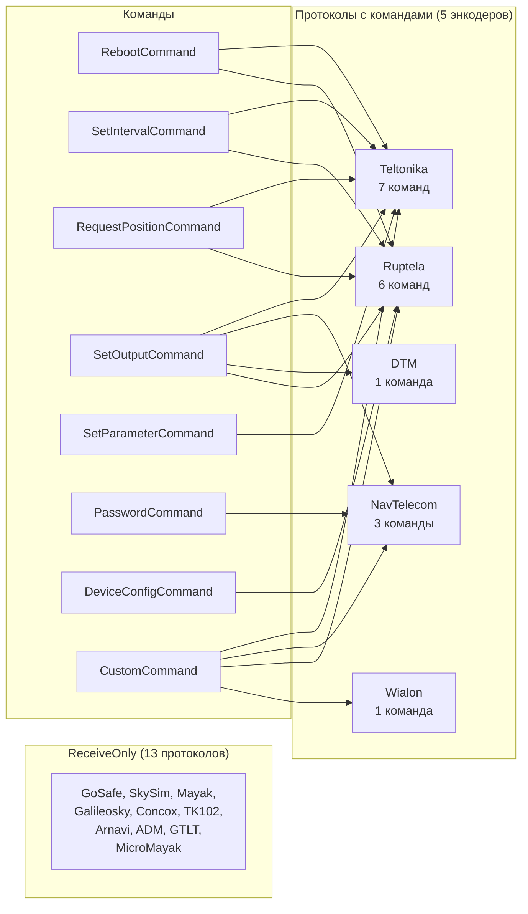
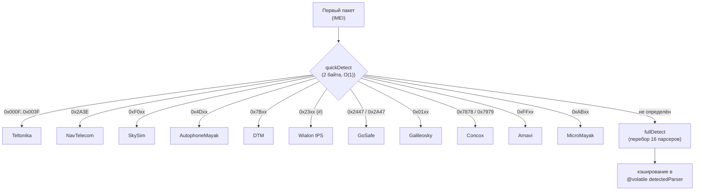

# Connection Manager — GPS Протоколы v4.0

> Тег: `АКТУАЛЬНО` | Обновлён: `2026-03-01` | Версия: `4.0`

## Обзор

Connection Manager поддерживает **18 GPS-протоколов** от разных производителей трекеров.
Каждый протокол реализует trait `ProtocolParser` с 6 методами.
Для протоколов с поддержкой команд реализованы отдельные энкодеры в пакете `command/`.

## Сводная таблица протоколов

| # | Протокол | Порт | Тип | Парсер | Энкодер | Команды |
|---|---|---|---|---|---|---|
| 1 | Teltonika Codec 8/8E | 5001 | Binary BE | TeltonikaParser | TeltonikaEncoder | ✅ 7 |
| 2 | Wialon IPS (text) | 5002 | Text ASCII | WialonParser | WialonEncoder | ✅ 1 |
| 3 | Ruptela | 5003 | Binary BE | RuptelaParser | RuptelaEncoder | ✅ 6 |
| 4 | NavTelecom FLEX | 5004 | Binary LE | NavTelecomParser | NavTelecomEncoder | ✅ 3 |
| 5 | GoSafe | 5005 | Text ASCII | GoSafeParser | ReceiveOnly | — |
| 6 | SkySim (SkyPatrol) | 5006 | Binary | SkySimParser | ReceiveOnly | — |
| 7 | Автофон Маяк | 5007 | Binary LE | AutophoneMayakParser | ReceiveOnly | — |
| 8 | ДТМ (DTM) | 5008 | Binary | DtmParser | DtmEncoder | ✅ 1 |
| 9 | Galileosky | 5009 | Binary LE | GalileoskyParser | ReceiveOnly | — |
| 10 | Concox GT06 | 5010 | Binary BE | ConcoxParser | ReceiveOnly | — |
| 11 | TK102/TK103 | 5011 | Text ASCII | TK102Parser | ReceiveOnly | — |
| 12 | Arnavi | 5012 | Binary LE | ArnaviParser | ReceiveOnly | — |
| 13 | ADM | 5013 | Binary | AdmParser | ReceiveOnly | — |
| 14 | Queclink GTLT | 5014 | Text ASCII | GtltParser | ReceiveOnly | — |
| 15 | МикроМаяк | 5015 | Binary LE | MicroMayakParser | ReceiveOnly | — |
| 16 | Wialon Binary | — | Binary LE | WialonBinaryParser | WialonEncoder | ✅ 1 |
| 17 | Wialon Adapter | — | Auto-detect | WialonAdapterParser | WialonEncoder | ✅ 1 |
| 18 | **MultiProtocol** | 5100 | Auto-detect | MultiProtocolParser | (делегирует) | (делегирует) |

## Матрица поддержки команд



---

## Протоколы — Детальное описание

### 1. Teltonika (Codec 8/8E)

| Параметр | Значение |
|---|---|
| TCP порт | 5001 |
| Тип | Binary (Big-Endian) |
| Файл | `TeltonikaParser.scala` |
| Энкодер | `TeltonikaEncoder.scala` (Codec 12) |
| Модели | FM1100, FM3001, FMB920, FMU130 |
| Команды | Reboot, SetInterval, RequestPosition, SetOutput, SetParameter, Custom (TCP) |

**Структура пакета:**
```
IMEI: [2B length][IMEI ASCII string]
DATA: [4B zeros][4B data_length][1B codec_id][1B n_records][...records][1B n_records][4B CRC-16-IBM]
```

**Codec 8E:** Extended codec с 2-byte IO element IDs.  
**Координаты:** int32 / 10_000_000 (×10^-7)  
**Скорость:** uint16 km/h  
**CRC:** CRC-16-IBM (4 байта)

**Формат команды (Codec 12):**
```
[4B zeros preamble][4B data_length][0x0C codec][1B qty][0x05 type][4B cmd_size][UTF-8 data][1B qty][4B CRC-16-IBM]
```

---

### 2. Wialon IPS (text)

| Параметр | Значение |
|---|---|
| TCP порт | 5002 |
| Тип | Text (ASCII, \r\n) |
| Файл | `WialonParser.scala` |
| Энкодер | `WialonEncoder.scala` (#M# text) |
| Модели | Wialon-совместимые трекеры |
| Команды | Custom (#M#{text}\r\n) |

**Пакеты:**
```
LOGIN:  #L#imei;password\r\n
SHORT:  #SD#date;time;lat1;lat2;lon1;lon2;speed;course;alt;sats\r\n
DATA:   #D#date;time;lat1;lat2;lon1;lon2;speed;course;alt;sats;hdop;inputs;outputs;adc;ibutton;params\r\n
CMD:    #M#text\r\n
```

**Координаты:** `DDMM.MMMM;D` (D = N/S/E/W)  
**ACK:** `#AL#1` (успех) / `#AL#0` (ошибка)

---

### 3. Ruptela

| Параметр | Значение |
|---|---|
| TCP порт | 5003 |
| Тип | Binary (Big-Endian) |
| Файл | `RuptelaParser.scala` |
| Энкодер | `RuptelaEncoder.scala` (binary 0x65-0x67) |
| Модели | FM-Eco4, FM-Pro4, FM-Tco4 |
| Команды | Reboot(0x65), SetInterval(0x65), RequestPosition(0x66), SetOutput(0x67), DeviceConfig(0x66), Custom(0x66) |

**Структура:**
```
[2B length][8B IMEI][1B cmd_id][1B n_records][...records][2B CRC-16]
```

**Координаты:** int32 / 10_000_000 (×10^-7)  
**Скорость:** uint16 km/h  
**CRC:** CRC-16 (2 байта)

---

### 4. NavTelecom FLEX

| Параметр | Значение |
|---|---|
| TCP порт | 5004 |
| Тип | Binary (Little-Endian) |
| Файл | `NavTelecomParser.scala` |
| Энкодер | `NavTelecomEncoder.scala` (NTCB FLEX) |
| Модели | Smart S-2423 и др. |
| Команды | Password(>PASS:), SetOutput(!N Y/N), Custom |

**Сигнатура:** `*>` (0x2A 0x3E)  
**IMEI:** Variable-length ASCII  
**Координаты:** float64 LE degrees  
**CRC:** CRC-16-CCITT

**Формат команды (NTCB FLEX):**
```
[0x2A3E signature][2B length LE][0x0300 MsgID LE][0x01 cmd_code][data][2B CRC-16-CCITT LE]
```

---

### 5. GoSafe

| Параметр | Значение |
|---|---|
| TCP порт | 5005 |
| Тип | ASCII (text) |
| Файл | `GoSafeParser.scala` |
| Энкодер | ReceiveOnly |
| Модели | G3S, G6S |

**Формат IMEI:** `*GS[ver],IMEI,[pwd]#`  
**Формат данных:** `$IMEI,DDMMYYHHMMSS,lat,N/S,lon,E/W,speed,course,alt,sats#`  
**Координаты:** decimal degrees с N/S/E/W prefix  
**Скорость:** knots → km/h (×1.852)  
**ACK:** `OK\r\n`

---

### 6. SkySim (SkyPatrol)

| Параметр | Значение |
|---|---|
| TCP порт | 5006 |
| Тип | Binary |
| Файл | `SkySimParser.scala` |
| Энкодер | ReceiveOnly |
| Модели | SkyPatrol TT8750+ |

**Header:** 0xF0  
**IMEI:** 15 bytes ASCII  
**Координаты:** int32 × 10^-6  
**Скорость:** uint8 km/h

---

### 7. Автофон Маяк (AutophoneMayak)

| Параметр | Значение |
|---|---|
| TCP порт | 5007 |
| Тип | Binary (Little-Endian) |
| Файл | `AutophoneMayakParser.scala` |
| Энкодер | ReceiveOnly |
| Модели | Автофон SE, Маяк |

**Header:** 0x4D ('M')  
**IMEI:** 15 bytes ASCII  
**Координаты:** int32 LE × 10^-6  
**Records:** 20 bytes (lat, lon, speed, alt, timestamp, battery, temperature, gsm)

---

### 8. ДТМ (DTM)

| Параметр | Значение |
|---|---|
| TCP порт | 5008 |
| Тип | Binary |
| Файл | `DtmParser.scala` |
| Энкодер | `DtmEncoder.scala` (binary IOSwitch) |
| Модели | ДТМ.07, ДТМ.08 |
| Команды | SetOutput (IOSwitch: 0x09+index, 0x00/0x01) |

**Header:** 0x7B ('{')  
**IMEI:** 15 bytes ASCII  
**Координаты:** int32 × 10^-7  
**Скорость:** uint16 × 0.1 km/h

**Формат команды:**
```
[0x7B header][0x02 len][0xFF][XOR checksum][0x09+outputIndex][0x00|0x01 value][0x7D footer]
```

---

### 9. Galileosky

| Параметр | Значение |
|---|---|
| TCP порт | 5009 |
| Тип | Binary (Little-Endian) |
| Файл | `GalileoskyParser.scala` |
| Энкодер | ReceiveOnly |
| Модели | Galileosky 7x, Base Block |

**Header:** 0x01  
**IMEI:** из tag 0x03 (15 bytes ASCII)  
**Координаты:** int32 LE × 10^-7  
**CRC:** CRC-16 (2B LE)

---

### 10. Concox GT06

| Параметр | Значение |
|---|---|
| TCP порт | 5010 |
| Тип | Binary (Big-Endian) |
| Файл | `ConcoxParser.scala` |
| Энкодер | ReceiveOnly |
| Модели | GT06N, JM-VL01, GV20 |

**Start marker:** 0x7878 или 0x7979  
**IMEI:** 8 bytes BCD (cmd 0x01)  
**Координаты:** int32 / 1_800_000  
**CRC:** CRC-ITU (2B)

---

### 11. TK102/TK103

| Параметр | Значение |
|---|---|
| TCP порт | 5011 |
| Тип | Text (ASCII) |
| Файл | `TK102Parser.scala` |
| Энкодер | ReceiveOnly |
| Модели | TK102, TK103, GPS103 |

**IMEI:** `##,imei:XXXXXXXXX,A;` или `imei:XXX;`  
**Данные:** GPRMC sentence внутри текстового фрейма  
**ACK:** `LOAD` (для login), `ON` (для heartbeat)

---

### 12. Arnavi

| Параметр | Значение |
|---|---|
| TCP порт | 5012 |
| Тип | Binary (Little-Endian) |
| Файл | `ArnaviParser.scala` |
| Энкодер | ReceiveOnly |
| Модели | Arnavi 4 |

**Header:** 0xFF  
**IMEI:** 4B uint32 LE (device serial)  
**Координаты:** float32 LE  
**CRC:** XOR checksum

---

### 13. ADM

| Параметр | Значение |
|---|---|
| TCP порт | 5013 |
| Тип | Binary |
| Файл | `AdmParser.scala` |
| Энкодер | ReceiveOnly |
| Модели | ADM300, ADM333 |

**STX:** 0x01  
**IMEI:** 15 bytes ASCII (cmd 0x03)  
**Координаты:** float32 × 10^-6  
**CRC:** XOR checksum

---

### 14. Queclink GTLT

| Параметр | Значение |
|---|---|
| TCP порт | 5014 |
| Тип | Text (ASCII) |
| Файл | `GtltParser.scala` |
| Энкодер | ReceiveOnly |
| Модели | GL300, GB100, GV55 |

**IMEI:** `+RESP:GT...` → 15-digit field  
**Координаты:** decimal degrees в ASCII  
**CRC:** нет (text protocol)

---

### 15. МикроМаяк (MicroMayak)

| Параметр | Значение |
|---|---|
| TCP порт | 5015 |
| Тип | Binary (Little-Endian) |
| Файл | `MicroMayakParser.scala` |
| Энкодер | ReceiveOnly |
| Модели | МикроМаяк M15 |

**Header:** 0xAB  
**IMEI:** 4B uint32 LE (device serial)  
**Координаты:** int32 LE × 10^-6  
**CRC:** sum & 0xFF

---

### 16. Wialon Binary

| Параметр | Значение |
|---|---|
| TCP порт | (через Wialon Adapter на 5002) |
| Тип | Binary (Little-Endian) |
| Файл | `WialonBinaryParser.scala` |
| Энкодер | `WialonEncoder.scala` |

**IMEI:** null-terminated ASCII  
**Координаты:** float32 LE degrees  
**Скорость:** float32 LE km/h

---

### 17. Wialon Adapter

| Параметр | Значение |
|---|---|
| TCP порт | (мета-парсер для 5002) |
| Тип | Auto-detect (text/binary) |
| Файл | `WialonAdapterParser.scala` |
| Энкодер | `WialonEncoder.scala` |

**Алгоритм:** Анализирует первый пакет. Если начинается с `#` → WialonParser (text), иначе → WialonBinaryParser.

---

## MultiProtocolParser (AutoDetect)

**TCP порт:** 5100  
**Файл:** `MultiProtocolParser.scala`

Определяет протокол по содержимому первого IMEI-пакета.
Содержит 16 парсеров (все кроме WialonBinary и WialonAdapter).

### Алгоритм детекции



### Порядок полного перебора (по специфичности)

```
1. Teltonika    │  5. GoSafe        │  9.  Galileosky  │ 13. ADM
2. NavTelecom   │  6. SkySim        │ 10. Concox       │ 14. GTLT
3. Ruptela      │  7. AutophoneMayak│ 11. TK102        │ 15. MicroMayak
4. DTM          │  8. Arnavi        │ 12. GTLT         │ 16. Wialon (fallback)
```

---

## Trait ProtocolParser

```scala
trait ProtocolParser:
  def protocolName: String              // "teltonika", "wialon", ...
  def parseImei(buffer: ByteBuf): IO[ProtocolError, String]
  def parseData(buffer: ByteBuf, imei: String): IO[ProtocolError, List[GpsRawPoint]]
  def imeiAck(success: Boolean): ByteBuf
  def ack(count: Int): ByteBuf
  def encodeCommand(command: Command): IO[ProtocolError, ByteBuf]  // делегирует в CommandEncoder
```

## GpsRawPoint

Промежуточная структура после парсинга (до фильтрации):

```scala
case class GpsRawPoint(
  latitude: Double,     // Десятичные градусы (-90..90)
  longitude: Double,    // Десятичные градусы (-180..180)
  altitude: Double,     // Метры
  speed: Double,        // km/h
  angle: Int,           // 0..360
  satellites: Int,      // Количество спутников
  timestamp: Long,      // Unix millis (device time)
  ioElements: Map[String, String]  // Дополнительные параметры (опционально)
)
```

## Сводка по legacy-маппингу (STELS → CM)

```
STELS port  → CM port  │ Протокол
9082        → 5008     │ DTM
9083        → 5007     │ AutophoneMayak
9084        → 5006     │ SkySim
9085        → 5004     │ NavTelecom
9086        → 5005     │ GoSafe
9087        → 5002     │ Wialon IPS
9088        → 5001     │ Teltonika
9089        → 5003     │ Ruptela
(new)       → 5009     │ Galileosky
(new)       → 5010     │ Concox GT06
(new)       → 5011     │ TK102/TK103
(new)       → 5012     │ Arnavi
(new)       → 5013     │ ADM
(new)       → 5014     │ Queclink GTLT
(new)       → 5015     │ МикроМаяк
(new)       → 5100     │ MultiProtocol AutoDetect
```
